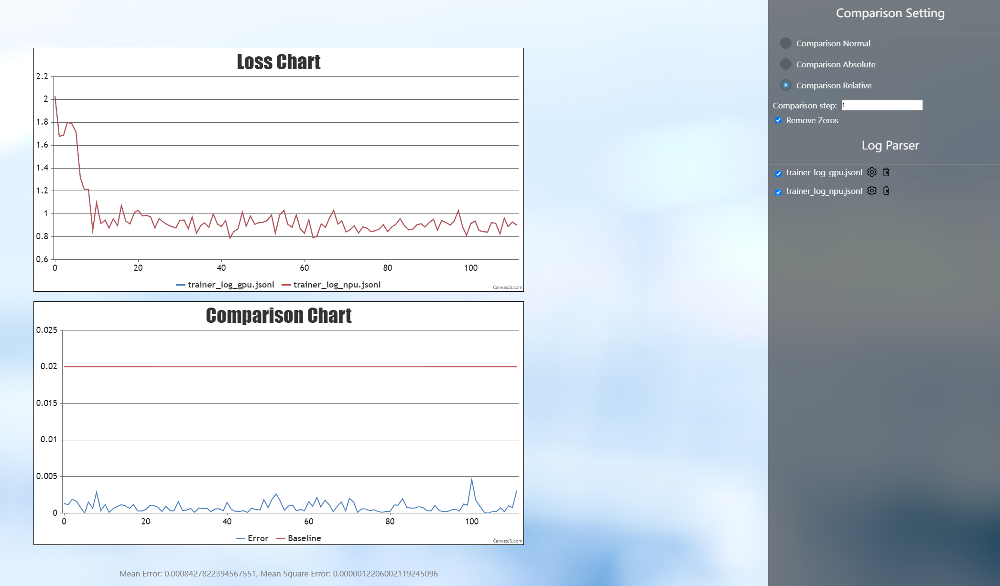

# InternLM-NPU

<div align="center">


  <div> </div>
  <div align="center">
    <b><font size="5">InternLM</font></b>
    <sup>
      <a href="https://internlm.intern-ai.org.cn/">
        <i><font size="4">HOT</font></i>
      </a>
    </sup>
    <div> </div>
  </div>

[](./LICENSE)
[](https://github.com/internLM/OpenCompass/)

<!-- [](https://internlm.readthedocs.io/zh_CN/latest/?badge=latest) -->

[📘Commercial Application](#license) |
[🤗HuggingFace](https://huggingface.co/internlm) |
[🆕Update News](#news) |
[🤔Reporting Issues](https://github.com/InternLM/InternLM/issues/new) |
[📜Technical Report](https://arxiv.org/abs/2403.17297)<br>
[💬Chat Web](https://internlm-chat.intern-ai.org.cn/) |
[🔗API](https://internlm.intern-ai.org.cn/api/document) |
[🧩Modelers](https://modelers.cn/spaces/MindSpore-Lab/INTERNLM2-20B-PLAN)

[English](./README_npu.md) |
[简体中文](./README_npu_zh-CN.md)

</div>

## Introduction
This is a guide to using Ascend NPU to train and infer the InternLM series models.

## News
\[2025.01.15\] InternLM3-8B-Instruct can be used in Xtuner, LLaMa-Factory and transformers.

## Model Zoo

### InternLM3

| Model                     | Transformers(HF)                                         | ModelScope(HF)                                         | Modelers(HF)                                          | Release Date |
| ------------------------- | -------------------------------------------------------- | ------------------------------------------------------ | ----------------------------------------------------- | ------------ |
| **InternLM3-8B-Instruct** | [🤗internlm3_8B_instruct](https://huggingface.co/internlm/internlm3-8b-instruct) | [ internlm3_8b_instruct](https://www.modelscope.cn/models/Shanghai_AI_Laboratory/internlm3-8b-instruct/summary) | [](https://modelers.cn/models/Intern/internlm3-8b-instruct) | 2025-01-15   |
## Environment Setup

### Installing Ascend CANN Toolkit and Kernels

For details about the installation method, see [Installation Scheme](https://gitee.com/link?target=https%3A%2F%2Fwww.hiascend.com%2Fdocument%2Fdetail%2Fzh%2FCANNCommunityEdition%2F80RC2alpha002%2Fquickstart%2Fquickstart%2Fquickstart_18_0004.html) or run the following commands:

```shell
# Replace the URL with the URL corresponding to the CANN version and device model.
# Install CANN Toolkit.
wget https://ascend-repo.obs.cn-east-2.myhuaweicloud.com/Milan-ASL/Milan-ASL%20V100R001C17SPC701/Ascend-cann-toolkit_8.0.RC1.alpha001_linux-"$(uname -i)".run
bash Ascend-cann-toolkit_8.0.RC1.alpha001_linux-"$(uname -i)".run --install

# Install CANN Kernels.
wget https://ascend-repo.obs.cn-east-2.myhuaweicloud.com/Milan-ASL/Milan-ASL%20V100R001C17SPC701/Ascend-cann-kernels-910b_8.0.RC1.alpha001_linux.run
bash Ascend-cann-kernels-910b_8.0.RC1.alpha001_linux.run --install

# Set environment variables.
source /usr/local/Ascend/ascend-toolkit/set_env.sh
```

## Xtuner

### Installing Xtuner

```shell
git clone https://github.com/InternLM/xtuner.git
cd xtuner
```

Modify `requirements/runtime.txt` with the following changes:

```text
bitsandbytes==0.42.0
mmengine==0.10.5
torchvision==0.19.0
numpy==1.26.4
```

Use the following command for installation:

```shell
pip install -e '.[all]'
```

**Note**:

- The default installation version of `torch` is the latest version. Please pay attention to match it with the version of `torch_npu`.

### LoRA Fine-tuning

Use the following commands to copy and rename the file to `internlm3_8b_instruct_lora_oasst1_e10.py`:

```shell
xtuner copy-cfg internlm2_5_chat_7b_qlora_oasst1_e3 .
mv internlm2_5_chat_7b_qlora_oasst1_e3_copy.py internlm3_8b_instruct_lora_oasst1_e10.py
```

The modifications to the configuration file `internlm3_8b_instruct_lora_oasst1_e10.py` are as follows:

```python
pretrained_model_name_or_path = 'internlm/internlm3-8b-instruct'

max_epochs = 10

model = dict(
    type=SupervisedFinetune,
    use_varlen_attn=use_varlen_attn,
    llm=dict(
        type=AutoModelForCausalLM.from_pretrained,
        pretrained_model_name_or_path=pretrained_model_name_or_path,
        trust_remote_code=True,
        torch_dtype=torch.float16),
        # quantization_config=dict(
        #     type=BitsAndBytesConfig,
        #     load_in_4bit=True,
        #     load_in_8bit=False,
        #     llm_int8_threshold=6.0,
        #     llm_int8_has_fp16_weight=False,
        #     bnb_4bit_compute_dtype=torch.float16,
        #     bnb_4bit_use_double_quant=True,
        #     bnb_4bit_quant_type='nf4')),
    lora=dict(
        type=LoraConfig,
        r=64,
        lora_alpha=16,
        lora_dropout=0.1,
        bias='none',
        task_type='CAUSAL_LM'))

custom_hooks = [
    dict(type=DatasetInfoHook, tokenizer=tokenizer),
    # dict(
    #     type=EvaluateChatHook,
    #     tokenizer=tokenizer,
    #     every_n_iters=evaluation_freq,
    #     evaluation_inputs=evaluation_inputs,
    #     system=SYSTEM,
    #     prompt_template=prompt_template)
]

randomness = dict(seed=123, deterministic=True)
```

Run the following commands to start single-machine eight-card fine-tuning:

```shell
NPROC_PER_NODE=8 xtuner train internlm3_8b_instruct_lora_oasst1_e10.py --deepspeed deepspeed_zero2
```

The fine-tuning results are saved in the directory `./work_dirs/internlm3_8b_instruct_lora_oasst1_e10/iter_xxx.pth`.
The comparison of loss between NPU and GPU is as follows:


### Model Convert

Convert the model weight file obtained from fine-tuning into the Hugging Face format, which facilitates subsequent deployment and usage.
Use the following command for the conversion:

```shell
xtuner convert pth_to_hf internlm3_8b_instruct_lora_oasst1_e10.py ./work_dirs/internlm3_8b_instruct_lora_oasst1_e10/iter_xxx.pth ./work_dirs/convert_output
```

### Model Merge

LoRA or QLoRA fine-tuning generates an additional `Adapter` layer, which needs to be merged with the original model to 
create a complete model. Use the following command for model merging, where `$model_path` is the local path where the 
original model is stored, and `--max-shard-size` 2GB limits the maximum size of each weight file to 2GB:

```shell
xtuner convert merge $model_path ./work_dirs/convert_output ./work_dirs/merge_output --max-shard-size 2GB
```

### Chat

Chat with the merged model weights:


```shell
cp path_to_your_model/modeling_internlm3.py ./work_dirs/merge_output
xtuner chat ./work_dirs/merge_output --prompt-template internlm2_chat
```

## LLama-Factory

### Installing LLaMa-Factory

```shell
git clone --depth 1 https://github.com/hiyouga/LLaMA-Factory.git
cd LLaMA-Factory
pip install -e ".[torch-npu,metrics]"
```

### Inference

Create the `examples/inference/internlm3_8b_instruct.yaml` inference configuration file in the LLaMa-Factory directory:

```yaml
model_name_or_path: xxx # Support only local loading. Set this parameter to the local weight path of InternLM3-8B-Instruct.
trust_remote_code: true
template: intern3
```

Run the following command to interact with the model:

```shell
llamafactory-cli chat examples/inference/internlm3_8b_instruct.yaml
```

### Fine-tuning

Create the `examples/train_full/internlm3_8b_instruct_full_sft.yaml` configuration file in the LLaMa-Factory directory. The fine-tuning configuration file is as follows:

```yaml
### model
model_name_or_path: xxx # Support only local loading. Set this parameter to the local weight path of InternLM3-8B-Instruct.
trust_remote_code: true

### method
stage: sft
do_train: true
finetuning_type: full
deepspeed: examples/deepspeed/ds_z3_config.json  # choices: [ds_z0_config.json, ds_z2_config.json, ds_z3_config.json]

### dataset
dataset: alpaca_data
template: intern3
cutoff_len: 4096
max_samples: 10000
overwrite_cache: true
preprocessing_num_workers: 16

### output
output_dir: saves/interlm3/full/sft
logging_steps: 10
save_steps: 500
plot_loss: true
overwrite_output_dir: true

### train
per_device_train_batch_size: 1
gradient_accumulation_steps: 1
learning_rate: 1.0e-6
num_train_epochs: 1.0
lr_scheduler_type: cosine
warmup_ratio: 0.1
bf16: true
ddp_timeout: 180000000

### eval
val_size: 0.1
per_device_eval_batch_size: 1
eval_strategy: steps
eval_steps: 5000000000
```

Run the following commands to start fine-tuning:

```shell
llamafactory-cli train examples/train_full/internlm3_8b_instruct_full_sft.yaml
```

### Accuracy

The loss curve obtained after finetuning is as follows:


The loss curve compared with GPU is as follows:



## Transformers

### Inference

Create the inference script `inference_internlm2_5_7b_chat.py`:

```python
import torch
from transformers import AutoTokenizer, AutoModelForCausalLM

# 若模型已下载，可替换成模型本地路径
tokenizer = AutoTokenizer.from_pretrained("internlm/internlm2_5-7b-chat", trust_remote_code=True)
# `torch_dtype=torch.float16`可以令模型以float16精度加载，否则transformers会将模型加载为float32，导致显存不足
model = AutoModelForCausalLM.from_pretrained("internlm/internlm2_5-7b-chat", torch_dtype=torch.float16, trust_remote_code=True).npu()
model = model.eval()
response, history = model.chat(tokenizer, "你好，请提供三个管理时间的建议。", history=[])
print(response)
```

Execute the inference script:

```shell
python inference_internlm2_5_7b_chat.py
```


## License
The code is licensed under Apache-2.0, while model weights are fully open for academic research and also allow **free** commercial usage. To apply for a commercial license, please fill in the [application form (English)](https://wj.qq.com/s2/12727483/5dba/)/[申请表（中文）](https://wj.qq.com/s2/12725412/f7c1/). For other questions or collaborations, please contact <internlm@pjlab.org.cn>.