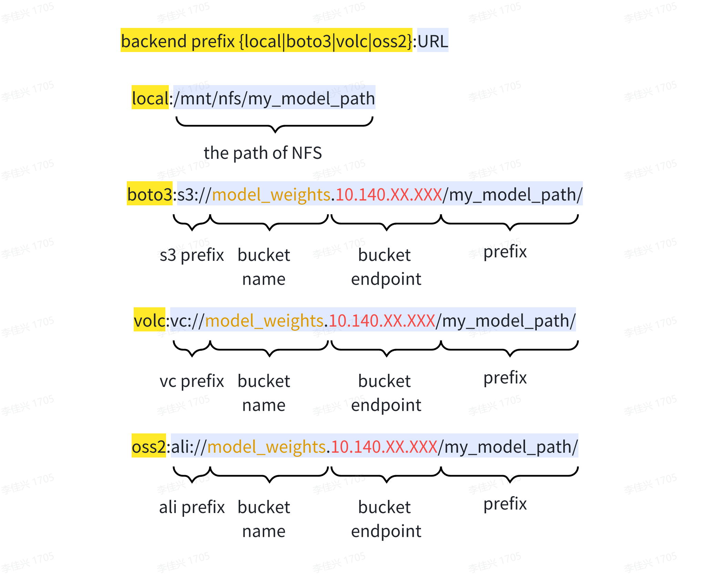

模型加载与保存
===================

InternLM 使用 ``internlm.utils.model_checkpoint.CheckpointManager`` 来管理模型保存。其中，可以使用 ``CheckpointManager.try_save_checkpoint(train_state)`` 来保存指定 step 的模型状态。

InternLM支持启动时自动加载最新的模型备份，并在接收信号退出训练时自动进行模型备份。

CheckpointManager
--------------------------

``CheckpointManager`` 是InternLM负责进行模型加载和保存的工具类，其会使用config文件中的ckpt字段的初始化参数字典初始化自身的参数，目前相关的参数有：

- ``enable_save_ckpt``: 是否开启检查点存储功能（不影响检查点加载）。参数类型 ``bool``，必选参数。

- ``save_ckpt_folder``: 检查点存储路径，参数类型 ``str``，默认为： ``None``，在开启检查点存储功能时为必选参数。

- ``checkpoint_every``: 检查点存储频率，参数类型 ``int``，默认为： ``50``。

- ``load_ckpt_folder``: 初始化检查点/权重加载路径。参数类型 ``str``，默认为： ``None``，详见 :ref:`load-ckpt-folder`。

- ``async_upload``: 是否开启异步上传，默认值为：``False``，详见 :ref:`asyncupload`。

- ``async_upload_tmp_folder``: 异步上传临时存储路径。

- ``oss_snapshot_freq``: 快照存储频率，默认值为：``checkpoint_every``的一半。详见 :ref:`snapshot`。

- ``auto_resume``: 是否开启检查点自动恢复，默认值为：``True``，详见 :ref:`autoresume`。

- ``stop_file_path`` : 检查点存储控制文件的路径，默认值为：``None``，详见 :ref:`stopfile`。

下面给出config文件的参数设置例子：

.. code-block:: python

  ckpt = dict(
      enable_save_ckpt=False,  # enable ckpt save.
      save_ckpt_folder=SAVE_CKPT_FOLDER,  # Path to save training ckpt.
      load_ckpt_folder=dict(path="local:/mnt/mfs/ckpt", content=["all",], ckpt_type="internlm"), 
      auto_resume=False, # disable auto-resume, internlm will load model checkpoint from the path of 'load_ckpt_folder'.
      checkpoint_every=CHECKPOINT_EVERY,
      async_upload=True,  # async ckpt upload. (only work for boto3 and volc ckpt)
      async_upload_tmp_folder="/dev/shm/internlm_tmp_ckpt/",  # path for temporarily files during asynchronous upload.
      oss_snapshot_freq=int(CHECKPOINT_EVERY / 2),  # snapshot ckpt save frequency.
  )

.. autoclass:: internlm.utils.model_checkpoint.CheckpointManager
    :members:

加载与存储格式约定
--------------------------

.. _load-ckpt-folder:

(1) 路径格式约定
~~~~~~~~~~~~~~~~~~~~~~~~~~

InternLM对config中出现的所有存储路径都遵循以下的路径格式约定:

对于不同backend的路径，有以下的规则需要注意:

1. 如果需要使用boto3的路径，需要在运行前提前导入 ``S3_ACCESS_KEY_ID`` 和 ``S3_SECRET_ACCESS_KEY_ID`` 这两个环境变量。

2. 如果需要使用volc的路径，需要在运行前提前导入 ``VOLC_ACCESS_KEY_ID`` 和 ``VOLC_SECRET_ACCESS_KEY_ID`` 这两个环境变量。

3. bucket的endpoint一般分为Inside IP和Outside IP，如果可以尽量使用inside IP，会获得更佳的存储速度。

(2) 模型加载(load_ckpt_folder)格式约定
~~~~~~~~~~~~~~~~~~~~~~~~~~~~~~~~~~~~~~~~~~~~~~~~~~~~

load_ckpt_folder 由三个字段组成， ``path`` 、 ``content`` 和 ``ckpt_type`` 。

- ``path``：给出了检查点/初始化模型权重的加载路径（path的格式见下小节）

- ``content``: 表示需要加载的内容，目前支持的字段包括：

  - ``model``：加载模型权重。
  - ``sampler``：加载sampler状态。
  - ``scheduler``：加载lr_scheduler状态。
  - ``optimzier``：加载optimizer状态。
  - ``all``：表示所有状态均加载，一般在resume训练使用。

- ``ckpt_type``：表示加载的模型权重类型，目前支持的字段包括：

  - ``internlm``：internlm约定的checkpoint存储格式。

下面给出两个例子：

.. code-block:: python

  # 从文件存储相对路径 ckpt_model 中加载已有模型权重初始化模型，适合 sft 等训练初始化
  load_ckpt_folder= dict(path="local:ckpt_model", content=["model",], ckpt_type="internlm")

  # 从文件存储相对路径 ckpt_model 中加载所有的状态，适合断点续训的场景
  load_ckpt_folder= dict(path="local:ckpt_model", content=["all",], ckpt_type="internlm")

.. _asyncupload:

异步上传
--------------------------

异步上传会先同步的将模型存储到 ``async_upload_tmp_folder`` 中，再异步的写入远端存储（OSS/NFS）中。从而避免存储ckpt阻塞训练过长时间。

config.ckpt 中相关的参数：

- ``async_upload``: 是否开启异步上传。参数类型 ``bool/None``，默认为 ``False``。

- ``async_upload_tmp_folder``: 异步上传临时存储路径。参数类型 ``str/None``, 默认值为 ``/dev/shm/{JOB_NAME}_tmp_ckpt/``。

需要注意的是，异步上传功能仅在backend为boto3或volc时才会有效果，bcakend为local时只支持同步存储。

``async_upload_tmp_folder`` 设置的的原则为尽量设置为计算节点的local目录，这样才可以获得最佳的异步上传速度，一般来说建议为 ``/dev/shm`` 或 ``/nvme`` 下的路径，如果使用同步上传，则该路径可不给。

.. _snapshot:

快照检查点
--------------------------

快照检查点是一种特殊的检查点，其是为了减少模型因为训练崩溃（ECC error, NCCL error, .etc）等问题导致训练任务崩溃而损失的训练进度。其采用交替覆盖写的策略，所占用的存储大小为两个step的检查点所需的空间。配合上异步的检查点写入，在不影响训练速度和存储容量的条件下极大的增大了检查点的存储频率。

config.ckpt 中相关的参数：

- ``oss_snapshot_freq``: 快照存储频率。参数类型 ``int/None``，默认为 ``50``。

``oss_snapshot_freq`` 可以根据模型每step时间酌情设置，一般快照频率在1小时以下，半小时以上为怡/不给（默认值是 ``checkpoint_every`` 的二分之一）。

.. _autoresume:

检查点自动恢复
--------------------------

检查点自动加载功能的目的是在resume训练时，自动加载 ``save_ckpt_folder`` 路径下最新的检查点（包括snapshot检查点）。配合上自动重启机制，可以实现无人干预的任务自动恢复。

该功能默认开启，所以要注意如果需要加载 ``load_ckpt_folder`` 路径下的模型权重，要将 ``auto_resume`` 设置为 False，否则可能会产生预期外的行为。

config.ckpt 中相关的参数：

- ``auto_resume``: 是否开启检查点自动恢复。参数类型 ``bool``，默认为 ``True``。

``auto_resume`` 如果为True，则尝试从 ``save_ckpt_folder`` 路径中自动加载最新的ckpt，如果找不到，则从step 0开始训练。如果为False，则尝试从 ``load_ckpt_folder`` 中加载模型参数。

.. _stopfile:

手动控制检查点存储
--------------------------

在模型距离下一次检查点存储还有很长时间，这时如果希望立刻停止一个任务，又不希望丢失目前训练进度时可以使用手动控制检查点存储功能。通过向一个位于NFS上的 ``stop_file_path`` 文件中写入希望任务停止的step步数，Global Rank 0的进程会在每个step轮询该文件的值，如果发现有我们给出的停止step，则会进行一次广播通知所有的训练进程，约定各进程在训练到该step时存储一个检查点，并选择是否退出。

config.ckpt 中相关的参数：

- ``stop_file_path``：检查点存储控制文件的路径，参数类型 ``str/None``，默认为 ``None``，表示关闭该功能。

下面给出一个写入 ``stop_file_path`` 的例子：

.. code-block:: bash

  # 我们希望停止的step步数
  # 如果存入的step>0，则任务会在存储ckpt后自动退出
  # 如果存入的step<0，则任务会在存储ckpt后会继续训练
  echo "999" > ./llm_alter/1006_pr.log

