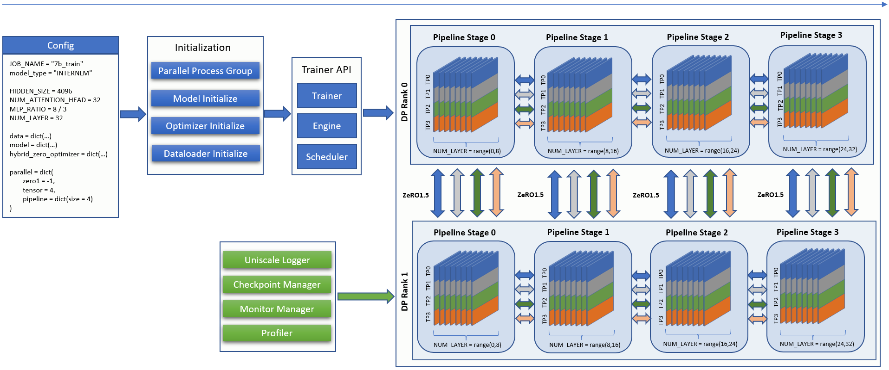

训练构建
==============

InternLM 的训练流程可以归纳为两个步骤：

1. 初始化

    * 初始化模型、优化器、数据加载器、Trainer，生成不同种类的进程组，为混合并行的迭代训练做准备。
    * 初始化Logger、Checkpoint管理器、Monitor管理器、Profiler，对迭代训练的过程观察、预警、记录。

2. 迭代训练
   
    * 根据配置文件定义的张量并行、流水线并行、数据并行的大小，加载训练引擎和调度器进行混合并行训练。
    * 在迭代训练中，调用 Trainer API 进行梯度置零，前向传播计算损失并反向传播，参数更新。

  InternLM训练流程图

.. _InternLM-args:

命令行参数解析
----------------

InternLM 使用 `argparse <https://docs.python.org/3/library/argparse.html>`_ 库来向InternLM运行时提供命令行参数配置。

用户可使用 ``internlm.initialize.get_default_parser()`` 来获取 InternLM 的默认解析器，其中包含一些内置参数，用户可以向此解析器添加自定义参数。

.. code-block:: python

    # Get InternLM default parser
    parser = internlm.initialize.get_default_parser()
    # Add new argument
    parser.add_argument("--user_arg", type=int, default=-1, help="arguments add by user.")
    cmd_args = parser.parse_args()

.. autofunction:: internlm.initialize.get_default_parser

.. _InternLM-model-init:

模型初始化
-------------------------

.. autofunction:: internlm.train.initialize_model

InternLM 在配置文件中使用字段 ``model_type`` 和 ``model`` 来控制模型初始化过程。示例模型初始化配置定义如下：

.. code-block:: python

    model_type = "INTERNLM"  # default is "INTERNLM", used to register classes and modules for model initialization
    NUM_ATTENTION_HEAD = 32
    VOCAB_SIZE = 103168
    HIDDEN_SIZE = 4096
    NUM_LAYER = 32
    MLP_RATIO = 8 / 3
    model = dict(
        checkpoint=False,  # The proportion of layers for activation aheckpointing, the optional value are True/False/[0-1]
        num_attention_heads=NUM_ATTENTION_HEAD,
        embed_split_hidden=True,
        vocab_size=VOCAB_SIZE,
        embed_grad_scale=1,
        parallel_output=True,
        hidden_size=HIDDEN_SIZE,
        num_layers=NUM_LAYER,
        mlp_ratio=MLP_RATIO,
        apply_post_layer_norm=False,
        dtype="torch.bfloat16",  # Support: "torch.float16", "torch.half", "torch.bfloat16", "torch.float32", "torch.tf32"
        norm_type="rmsnorm",
        layer_norm_epsilon=1e-5,
        use_flash_attn=True,
        num_chunks=1,  # if num_chunks > 1, interleaved pipeline scheduler is used.
    )

- 字段 ``model_type`` 指明了要初始化的模型类型
- 字段 ``model`` 中的参数指定了在模型初始化过程中的参数设置

值得注意的是，用户可以定义新的模型类型，并使用装饰器 ``@MODEL_INITIALIZER.register_module`` 注册模型的初始化函数，其中 ``MODEL_INITIALIZER`` 是类 ``internlm.util.registry.Registry`` 的一个实例化对象，示例如下所示：

.. code-block:: python

    MODEL_TYPE = "NEW_MODEL"

    @MODEL_INITIALIZER.register_module(module_name=MODEL_TYPE)
    def build_new_model_with_cfg(*args, **kwargs):

.. _InternLM-optim-init:

优化器初始化
-------------------------

.. autofunction:: internlm.train.initialize_optimizer

.. _InternLM-dl-init:

数据加载器初始化
-------------------------

.. autofunction:: internlm.train.get_train_data_loader

.. _InternLM-trainer-init:

Trainer 初始化
-------------------------

.. autofunction:: internlm.initialize.initialize_trainer