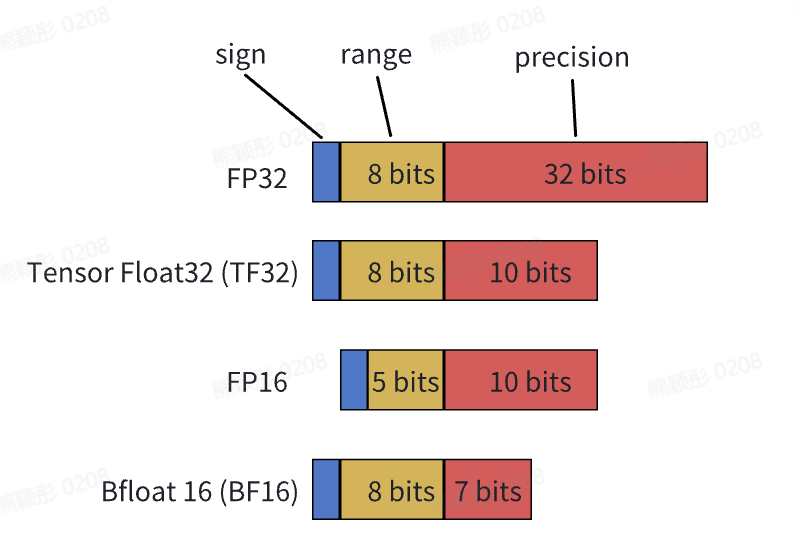

混合精度
============
混合精度是指在模型训练的过程中同时使用16位和32位浮点数类型，是一种在最小化精度损失的前提下加速模型训练的方法。
混合精度通过让模型的某些部分使用32位浮点数以保持数值稳定性，并在其余部分利用半精度浮点数加速训练并可以减少内存使用，在评估指标（如准确率）方面仍可以获得同等的训练效果。

.. autoclass:: internlm.core.naive_amp.NaiveAMPModel

InternLM默认将模型转换为16位浮点数类型进行训练（在配置文件中可以设置默认类型为其他数据类型）。在使用混合精度时，需要在构建模型时使用

.. code-block:: python

    set_fp32_attr_to_module(/*fp32 module*/)

将模型的某个子模块设置为32位浮点数类型进行训练，InternLM会在模型训练时自动将数据类型转换成需要的精度。

例如：

.. code-block:: python

    class MlpModel(nn.Module):
        def __init__(self):
            super().__init__()
            self.linear1 = nn.Linear(4, 1, bias=False)
            self.linear2 = nn.Linear(1, 4, bias=False)
            # set model.linear2 as fp32 module
            set_fp32_attr_to_module(model.linear2)

    model = MlpModel()

    # apply mixed precision
    model = NaiveAMPModel(
        model=model,
        output_to_fp32=True,
        dtype=torch.bfloat16(),
        sync_buffer=False,
    )

TF32训练
-----------------
TensorFloat-32（TF32）是Nvidia在Ampere架构GPU上推出的专门运用于TensorCore的一种计算格式。其与其他常用数据格式的比较如下图：

使用TF32的前置条件：

1. 输入数据类型为FP32，且计算为矩阵乘法及卷积相关运算，才可以使用TF32作为TensorCore的中间计算类型。

2. Ampere架构的GPU。

InternLM支持使用TF32训练模型，允许用户在config文件中将 ``dtype`` 设置为 ``torch.tf32``。

.. code-block:: python

    model = dict(
        checkpoint=False,  # The proportion of layers for activation aheckpointing, the optional value are True/False/[0-1]
        num_attention_heads=NUM_ATTENTION_HEAD,
        embed_split_hidden=True,
        vocab_size=VOCAB_SIZE,
        embed_grad_scale=1,
        parallel_output=True,
        hidden_size=HIDDEN_SIZE,
        num_layers=NUM_LAYER,
        mlp_ratio=MLP_RATIO,
        apply_post_layer_norm=False,
        dtype="torch.tf32",  # Support: "torch.float16", "torch.half", "torch.bfloat16", "torch.float32", "torch.tf32"
        norm_type="rmsnorm",
        layer_norm_epsilon=1e-5,
        use_flash_attn=True,
        num_chunks=1,  # if num_chunks > 1, interleaved pipeline scheduler is used.
    )

值得注意的是，TF32仅仅是在使用TensorCore时的一种中间计算格式，并不是一个完全的数据类型。因此，在InternLM中，尽管用户将 ``dtype`` 设置成了 ``torch.tf32``，模型的数据类型依旧是 ``torch.float32``。InternLM会针对 ``dtype`` 为 ``torch.tf32`` 的情况，设置以下变量来开启TF32训练。

.. code-block:: python

    torch.backends.cudnn.allow_tf32 = True
    torch.backends.cuda.matmul.allow_tf32 = True
