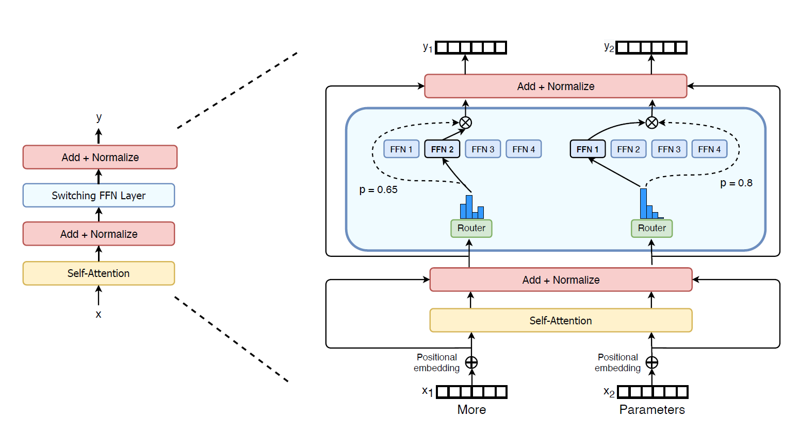

混合专家模型
==============
混合专家模型（Mixture-of-Experts, MoE）是一种特殊的模型结构。
混合专家模型将模型拆分为一系列称为“专家”的子模型，每个“专家” 具有唯一的权重。
混合专家模型可以针对每个输入标记仅激活一个或少量的专家参与运算。
例如，图 :ref:`switch_transformer` 是 `Switch Transformer <https://arxiv.org/pdf/2101.03961.pdf>`_ 提出的稀疏混合专家模型结构，其中的前向神经网络（FFN）被分解为多个子网络，在计算时仅有少部分的模型参数参与计算，以实现更有效的计算和资源分配。

稀疏混合专家模型通常还包含一个门控（gating）机制，例如图 :ref:`switch_transformer` 中的Router网络。门控网络负责选择激活哪些专家参与计算并组合不同专家的预测结果。

.. _switch_transformer:

   switch transformer

参数配置
----------------
如果在启动训练时要使用混合专家模型，可进行如下相关配置：

1. 模型相关配置

.. code-block:: python

    model = dict(
        num_experts=16,
        moe_gate_k=1,
    )

* num_experts：专家网络个数。在InternLM中，每个专家有着相同的网络结构但维护着不同的训练参数。
* moe_gate_k：门控策略。决定如何将输入标记路由到不同的专家进行计算。目前InternLM支持top1gating和top2gating两种门控策略。关于这些门控策略的详细的信息可以参考 `GShard <https://arxiv.org/pdf/2006.16668.pdf>`_。

注意：在目前的InternLM中，每个专家都是根据配置文件中HIDDEN_SIZE和MLP_RATIO构造的一个 `SwiGLU网络 <https://arxiv.org/pdf/2002.05202.pdf>`_，同时支持张量并行。用户可以根据需要构造自己的专家网络。

2. 损失相关配置

.. code-block:: python

    loss = dict(
        moe_loss_coeff=0.1,
    )

在top1gating和top2gating门控策略中，不同的专家处理的标记数量存在差异。为了提高模型效果，应尽量保证输入标记被均匀地路由到不同的专家上。InternLM采用 `GShard <https://arxiv.org/pdf/2006.16668.pdf>`_ 提出的负载平衡损失优化门控策略。
Moe_loss_coeff项决定着负载平衡损失项将如何添加到最终的损失项中（ :math:`l=l_{nll}+k·l_{moe}` ）。关于该部分的详细信息可以进一步参考 `GShard <https://arxiv.org/pdf/2006.16668.pdf>`_。

注意：这些参数需要和其他参数一起使用，具体请参考 :doc:`/usage` “训练配置”相关章节的内容。

模型训练
----------------

internlm.model.modeling_moe提供了一个标准的混合专家模型的实现，该模型的网络结构和图 :ref:`switch_transformer` 一致，其中使用到internlm.model.moe.MoE实现MoE网络。用户在配置文件中指定模型类型：

.. code-block:: python

    model_type = "INTERNLM_MoE"

并配置好稀疏专家网络的相关参数后，就可以像正常启动InternLM一样进行混合专家模型的分布式训练，具体请参考 :doc:`/usage` “启动训练”相关章节的内容。

.. autoclass:: internlm.model.moe.MoE

注意：InternLM支持用户定义自己的MoE结构。internlm.model.moe.MoE是定义MoE网络的接口，目前使用SwiGLU网络实现了专家模型并支持top1gating和top2gating两种门控策略。用户可以在MoE接口中对专家网络和门控策略进行扩展。
