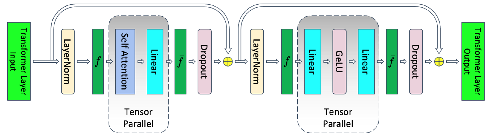
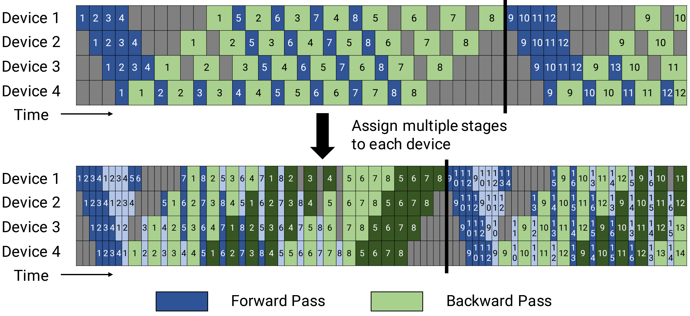
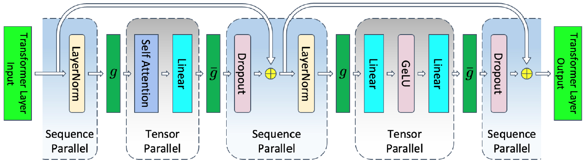

并行训练
==================

.. Brief introduction to training parallelism, and how-to guide about config setting

InternLM 支持张量并行、流水线并行、序列并行、数据并行和 ZeRO1.5 等并行化训练策略。在初始化分布式环境时，我们需要指定张量并行大小、流水线并行大小、数据并行大小以及 ZeRO1.5 策略。

InternLM 的并行设置由配置文件中的 ``parallel`` 字段指定，用户可以通过修改配置文件 `config file <https://github.com/InternLM/InternLM/blob/main/configs/7B_sft.py>`_ 来更改并行配置。以下是一个并行训练配置示例：

.. code-block:: python

    parallel = dict(
        zero1=8,
        tensor=1,
        pipeline=dict(size=1, interleaved_overlap=True),
        sequence_parallel=False,
    )

- zero1：zero 并行策略，分如下三种情况，默认值为 -1

    - 当 ``zero1 <= 0``，则 zero1 进程组的大小等于数据并行进程组的大小，因此优化器状态参数将在数据并行范围内分配
    - 当 ``zero1 == 1``，则不使用 zero1 ，所有数据并行组保留完整的优化器状态参数
    - 当 ``zero1 > 1`` 且 ``zero1 <= data_parallel_world_size``，则 zero1 进程组是数据并行进程组的子集

- tensor：张量并行大小，通常是每个节点的 GPU 数量，默认值为 1
- pipeline：流水线并行策略

    - size：流水线并行大小，默认值为 1
    - interleaved_overlap：bool 类型，交错式调度时，开启或关闭通信优化，默认值为 False

- sequence_parallel：是否开启序列化并行，默认值为 False

注意：数据并行大小 = 总的 GPU 数目 / 流水线并行大小 / 张量并行大小

张量并行
-----------------

InternLM 的张量并行实现方案基于 `flash attention <https://github.com/Dao-AILab/flash-attention>`_, 主要对 `attention <https://github.com/InternLM/InternLM/blob/main/internlm/model/multi_head_attention.py>`_ 和
`linear <https://github.com/InternLM/InternLM/blob/main/internlm/model/linear.py>`_ 这两个模块进行张量并行操作。

用户可通过配置文件中的 ``parallel.tensor`` 字段来设置张量并行大小。

  张量并行，采用自 `flash-attention <https://arxiv.org/pdf/2205.14135.pdf>`_

流水线并行
-----------------

InternLM 在流水线并行中使用 `1F1B <https://arxiv.org/pdf/2104.04473.pdf>`_ （1F1B，一次前向传递后跟一次反向传递）策略。对于 1F1B 策略，有两种实现方式：

1. 非交错调度器，内存高效。
2. 交错调度器，内存高效且时间高效（GPU空泡较少）。

  1F1B 流水线并行调度器，采用自 `Megatron-LM <https://arxiv.org/pdf/2104.04473.pdf>`_

非交错式流水线调度
~~~~~~~~~~~~~~~~~~~~~~~~~~~~~~~~~~~~~~~~~~~
如果要使用非交错式调度, 需要设置 ``model.num_chunks = 1``。

.. autoclass:: internlm.core.scheduler.pipeline_scheduler.PipelineScheduler
    :members:

交错式流水线调度
~~~~~~~~~~~~~~~~~~~~~~~~~~~~~~~~~~~~~~~
如果要使用交错式调度, 需要设置 ``model.num_chunks > 1``。

.. autoclass:: internlm.core.scheduler.pipeline_scheduler.InterleavedPipelineScheduler
    :members:

值得注意的是，在使用交错式流水线调度器时可启用通信优化功能，即在 1F1B 阶段启用异步通信，以充分利用上行/下行带宽并实现通信与计算重叠。

用户需要在配置文件中设置 ``parallel.pipeline.interleaved_overlap = True``。该功能启用后，将调用函数 ``InterleavedPipelineScheduler._run_1f1b_loop_with_overlap``，并创建 ``internlm.core.communication.AsynCommunicator`` 以管理异步通信。

``1F1B-without-overlap`` 和 ``1F1B-with-overlap`` 的区别如下所示：

.. code-block:: bash

    # The 1F1B stage without overlap consists of the following steps:
    1. Perform the forward pass.
    2. Perform the backward pass.
    3. Send the forward output of this iteration to the next stage, and send the backward output of this iteration to the previous stage, and receive the forward and backward inputs for the next iteration.

.. code-block:: bash

    # The 1F1B stage with overlap consists of the following steps:
    1. Perform the forward pass.
    2. Check if the backward input is ready.
    3. Send the forward output and receive the forward input for the next iteration.
    4. Perform the backward pass.
    5. Check if the forward input is ready.
    6. Send the backward output and receive the backward input for the next iteration.

序列并行
-----------------

序列并行是一种在不引入额外计算、通信和内存开销的情况下，减少层 ``layer_norm`` 和 ``dropout`` 操作中的激活值内存。InternLM 中的序列并行实现基于 `flash attention <https://github.com/Dao-AILab/flash-attention>`_。这个并行策略有助于降低模型的内存消耗，提高了模型在资源受限环境中的可扩展性。

如果要启用序列并行, 用户需要设置 ``parallel.sequence_parallel = True``。

  序列并行, 采用自 flash-attention

数据并行
-----------------

InternLM 支持数据并行。数据并行大小为:

`Data parallel size = Total number of GPUs / Pipeline parallel size / Tensor parallel size`

ZeRO1.5
-----------------

ZeRO1.5 的实现使用了分层分片的概念，通过配置值 ``parallel.zero1`` 启用了本地节点内的分片。这个方法有助于有效管理和分配模型参数和梯度，以减少内存使用并提高训练效率。

1. 当 ``parallel.zero1 <= 0``，则 zero1 进程组的大小等于数据并行进程组的大小，因此优化器状态参数将在数据并行范围内分配
2. 当 ``parallel.zero1 == 1``，则不使用 zero1 ，所有数据并行组保留完整的优化器状态参数
3. 当 ``parallel.zero1 > 1`` 且 ``parallel.zero1 <= data_parallel_world_size``，则 zero1 进程组是数据并行进程组的子集

此外，用户可以在配置文件中通过 ``hybrid_zero_optimizer`` 字段启用优化器的通信优化功能，设置桶大小，以及梯度剪裁等参数。这些设置有助于优化训练过程中的通信和计算效率，以及梯度的处理方式。

.. code-block:: python

    hybrid_zero_optimizer = dict(
        # Enable low_level_optimzer overlap_communication
        overlap_sync_grad=True,  
        overlap_sync_param=True,
        # bucket size for nccl communication params
        reduce_bucket_size=512 * 1024 * 1024,
        # grad clipping
        clip_grad_norm=1.0,
    )

这里有两个值得关注的通信优化点：

- overlap_sync_grad: 如果设置为 ``True``，则将训练的 ``backward pass`` 与梯度的 ``all-reduce`` 通信重叠
- overlap_sync_param: 如果设置为 ``True``，则将参数的 ``broadcast`` 通信与下一步的 ``forward pass`` 进行重叠

这些优化可以加速训练过程，提高训练效率。

.. autoclass:: internlm.solver.optimizer.hybrid_zero_optim.HybridZeroOptimizer
    :members:
