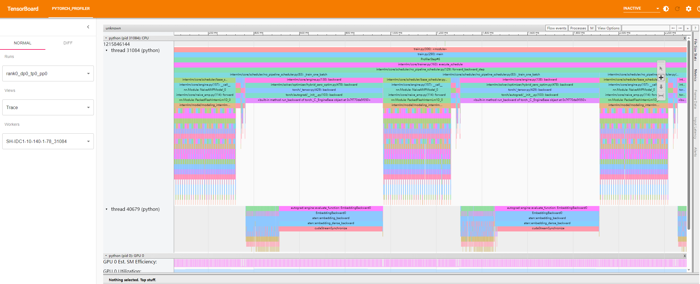
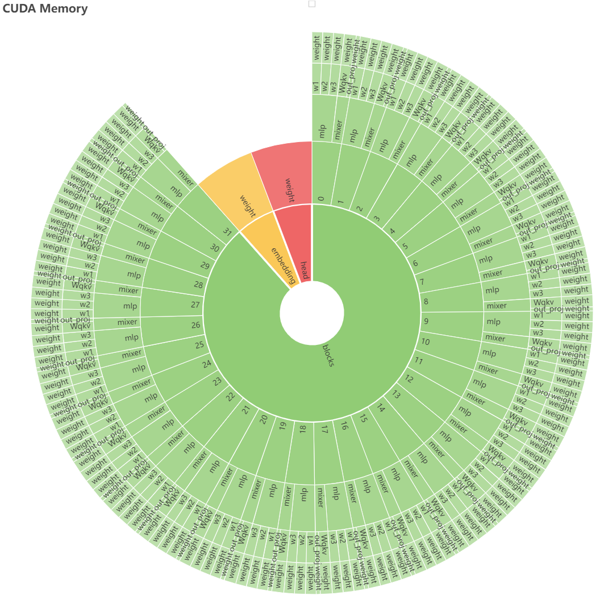

性能分析
========

.. Mainly about the usage of torch profiler and memory profiler

Torch Profiler
-----------------

InternLM 使用 ``internlm.train.initialize_llm_profile()`` 来收集和分析模型训练或推理期间的性能数据，如 CPU/CUDA/memory 等性能数据。这个实现基于 `torch.profiler <https://pytorch.org/docs/stable/profiler.html>`_ ，输出的性能分析 trace 文件可以使用 `tensorboard <https://www.tensorflow.org/tensorboard?hl=en>`_ 进行可视化。

用户如果想使用这个 torch 性能分析工具，需要在启动训练时传递 ``--profiling`` 参数以启用性能分析。完成 torch 性能分析后，用户可以在 ``{JOB_NAME}/{start_time}/traces/rank{}_dp{}_tp{}_pp{}`` 文件夹中看到性能分析结果。

实际运行生成的 ``Torch Profiler`` 目录结构如下：

.. code-block:: bash

    # tree ./7b_train/Sep08_11-00-51/traces -L 2
    ./7b_train/Sep08_11-00-51/traces/
    └── rank0_dp0_tp0_pp0
        └── SH-IDC1-10-140-1-78_238619.1694142354680.pt.trace.json

其中， ``traces`` 可以通过 ``TensorBoard`` 可视化，运行命令

.. code-block:: bash

    # visualize traces with tensorboard and custom port
    tensorboard --logdir rank0_dp0_tp0_pp0 --port 10088

在打开的 ``TensorBoard -> PyTorch Profiler -> Views -> Trace`` 页面可以看到Operator和GPU Kernel的性能分析时间线如下，更多的功能请参考 `torch profiler with tensorboard <https://pytorch.org/tutorials/intermediate/tensorboard_profiler_tutorial.html#pytorch-profiler-with-tensorboard>`_

.. autofunction:: internlm.train.initialize_llm_profile

Memory Profiler
-----------------

InternLM 提供了一个实用的内存分析工具 ``internlm.utils.simple_memory_profiler.SimpleMemoryProfiler`` 来监控实际的 GPU 内存使用情况。在实现中，会对模型数据（包括模型参数、模型梯度和优化器状态）和非模型数据（包括激活值）分别进行详细的统计。

要使用这个内存分析工具，用户需要在启动训练时传递 ``--profiling`` 参数以启用内存分析。完成内存分析后，用户可以在 ``memory_trace/rank{}_dp{}_tp{}`` 文件夹中找到特定 rank 对应的内存分析结果（包括不同时间点的内存使用日志和显示总体内存使用情况的太阳图表）。

实际运行生成的 ``memory_trace`` 目录结构如下：

.. code-block:: bash

    # tree ./memory_trace -L 2
    ./memory_trace
    ├── rank0_dp0_tp0                              # Profiling results for a specific rank device
    │   ├── activation_memory_sunburst.html        # Sunburst chart showing activation memory usage
    │   ├── grads_memory_sunburst.html             # Sunburst chart showing gradient memory usage
    │   ├── memory.log                             # Log of GPU memory usage at different time points
    │   ├── os_memory_sunburst.html                # Sunburst chart showing optimizer state memory usage
    │   ├── params_memory_sunburst.html            # Sunburst chart showing parameter memory usage
    │   └── summary_sunburst.html                  # Sunburst chart showing overall memory usage
    ├── rank1_dp1_tp0
    │   ├── activation_memory_sunburst.html
    │   ├── grads_memory_sunburst.html
    │   ├── memory.log
    │   ├── os_memory_sunburst.html
    │   ├── params_memory_sunburst.html
    │   └── summary_sunburst.html
    ├── rank2_dp2_tp0
    │   ├── activation_memory_sunburst.html
    │   ├── grads_memory_sunburst.html
    │   ├── memory.log
    │   ├── os_memory_sunburst.html
    │   ├── params_memory_sunburst.html
    │   └── summary_sunburst.html
    ├── rank3_dp3_tp0
    │   ├── activation_memory_sunburst.html
    │   ├── grads_memory_sunburst.html
    │   ├── memory.log
    │   ├── os_memory_sunburst.html
    │   ├── params_memory_sunburst.html
    │   └── summary_sunburst.html
    ├── rank4_dp4_tp0
    │   ├── activation_memory_sunburst.html
    │   ├── grads_memory_sunburst.html
    │   ├── memory.log
    │   ├── os_memory_sunburst.html
    │   ├── params_memory_sunburst.html
    │   └── summary_sunburst.html
    ├── rank5_dp5_tp0
    │   ├── activation_memory_sunburst.html
    │   ├── grads_memory_sunburst.html
    │   ├── memory.log
    │   ├── os_memory_sunburst.html
    │   ├── params_memory_sunburst.html
    │   └── summary_sunburst.html
    ├── rank6_dp6_tp0
    │   ├── activation_memory_sunburst.html
    │   ├── grads_memory_sunburst.html
    │   ├── memory.log
    │   ├── os_memory_sunburst.html
    │   ├── params_memory_sunburst.html
    │   └── summary_sunburst.html
    └── rank7_dp7_tp0
        ├── activation_memory_sunburst.html
        ├── grads_memory_sunburst.html
        ├── memory.log
        ├── os_memory_sunburst.html
        ├── params_memory_sunburst.html
        └── summary_sunburst.html

其中， ``memory.log`` 的内容示例如下：

.. code-block:: bash

    Memory State:
    time: 37.56313228607178
    ---summary---
    total_memory: 55953.56 MB
    params_memory: 13965.51 MB, grads_memory: 13965.51 MB, os_params_memory: 3461.52 MB, os_state_memory: 6923.03 MB, activation_memory: 17638.00 MB

    Memory State:
    time: 38.46969723701477
    ---summary---
    total_memory: 38315.56 MB
    params_memory: 13965.51 MB, grads_memory: 13965.51 MB, os_params_memory: 3461.52 MB, os_state_memory: 6923.03 MB, activation_memory: 0.00 MB
    ---Layout---
    params_layout:
    layer: param_mem, layer_mem: 0.00 MB, total_mem: 13965.51 MB
    layer: param_mem.embedding, layer_mem: 0.00 MB, total_mem: 806.00 MB
    layer: param_mem.embedding.weight, layer_mem: 806.00 MB, total_mem: 806.00 MB
    layer: param_mem.blocks, layer_mem: 0.00 MB, total_mem: 12353.50 MB
    layer: param_mem.blocks.0, layer_mem: 0.00 MB, total_mem: 386.05 MB
    layer: param_mem.blocks.0.mixer, layer_mem: 0.00 MB, total_mem: 128.03 MB
    layer: param_mem.blocks.0.mixer.Wqkv, layer_mem: 0.00 MB, total_mem: 96.02 MB
    layer: param_mem.blocks.0.mixer.Wqkv.weight, layer_mem: 96.00 MB, total_mem: 96.00 MB
    layer: param_mem.blocks.0.mixer.Wqkv.bias, layer_mem: 0.02 MB, total_mem: 0.02 MB
    layer: param_mem.blocks.0.mixer.out_proj, layer_mem: 0.00 MB, total_mem: 32.01 MB
    layer: param_mem.blocks.0.mixer.out_proj.weight, layer_mem: 32.00 MB, total_mem: 32.00 MB
    layer: param_mem.blocks.0.mixer.out_proj.bias, layer_mem: 0.01 MB, total_mem: 0.01 MB
    layer: param_mem.blocks.0.norm1, layer_mem: 0.00 MB, total_mem: 0.01 MB
    layer: param_mem.blocks.0.norm1.weight, layer_mem: 0.01 MB, total_mem: 0.01 MB
    layer: param_mem.blocks.0.norm2, layer_mem: 0.00 MB, total_mem: 0.01 MB
    layer: param_mem.blocks.0.norm2.weight, layer_mem: 0.01 MB, total_mem: 0.01 MB
    layer: param_mem.blocks.0.mlp, layer_mem: 0.00 MB, total_mem: 258.00 MB
    layer: param_mem.blocks.0.mlp.w1, layer_mem: 0.00 MB, total_mem: 86.00 MB
    layer: param_mem.blocks.0.mlp.w1.weight, layer_mem: 86.00 MB, total_mem: 86.00 MB
    layer: param_mem.blocks.0.mlp.w2, layer_mem: 0.00 MB, total_mem: 86.00 MB
    layer: param_mem.blocks.0.mlp.w2.weight, layer_mem: 86.00 MB, total_mem: 86.00 MB
    layer: param_mem.blocks.0.mlp.w3, layer_mem: 0.00 MB, total_mem: 86.00 MB
    layer: param_mem.blocks.0.mlp.w3.weight, layer_mem: 86.00 MB, total_mem: 86.00 MB
    ......
    grads_layout:
    ......
    os_params_layout:
    ......
    os_state_layout:
    ......
    activation_base_layout:
    ......

模型参数的太阳图示例如下：

.. autoclass:: internlm.utils.simple_memory_profiler.SimpleMemoryProfiler
    :members:
