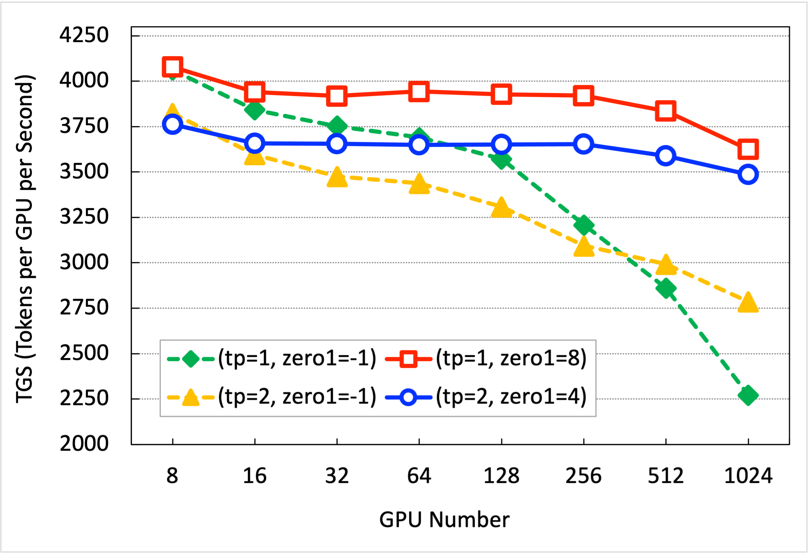
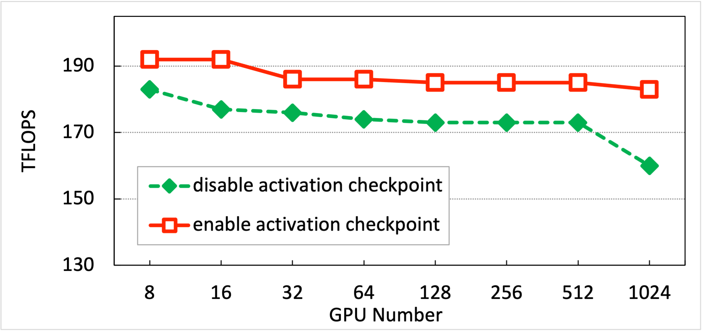

## Training Performance

InternLM deeply integrates Flash-Attention, Apex, and other high-performance model operators to improve training efficiency. It achieves efficient overlap of computation and communication, significantly reducing cross-node communication traffic during training by building the Hybrid Zero technique. InternLM supports expanding the 7B model from 8  GPUs to 1024 GPUs, with an acceleration efficiency of up to 90% at the thousand-card scale, a training throughput of over 180 TFLOPS, and an average of over 3600 tokens per GPU per second. The following table shows InternLM's scalability test data at different configurations:

| GPU Number         | 8   | 16  | 32  | 64  | 128  | 256  | 512  | 1024  |
| ---------------- | ---- | ---- | ---- | ---- | ----- | ----- | ----- | ------ |
| TGS (Tokens/GPU/Second) | 4078 | 3939 | 3919 | 3944 | 3928  | 3920  | 3835  | 3625   |
| TFLOPS  | 193 | 191  | 188  | 188  | 187   | 185   | 186   | 184    |

We tested the performance of training the 7B model in InternLM using various parallel configurations on a GPU cluster. In each test group, the number of tokens processed per GPU in a single iteration remained consistent. The hardware and parameter configurations used in the tests are shown in the table below:

| Hardware                | Model                         |
| ----------------------- | ----------------------------- |
| GPU                     | nvidia_a100-sxm4-80gb         |
| Memory                  | 2TB                           |
| Inter-machine bandwidth | 4 * 100Gb RoCE                |
| CPU                     | 128 core Intel(R) Xeon(R) CPU |

| Hyperparameters | tp=1 | tp=2 |
| --------------- | ---- | ---- |
| micro_num       | 4    | 4    |
| micro_bsz       | 2    | 4    |
| seq_len         | 2048 | 2048 |

The configuration of `zero1` in InternLM determines the allocation range of optimizer states.
- `zero1=-1` indicates that optimizer states are distributed across all data-parallel nodes (equivalent to Deepspeed Zero-1).
- In the case of `zero1=8, tp=1`, optimizer states are distributed within 8 GPUs in a single node, and the optimizer states remain consistent across different nodes.

### Throughput Measurement

Throughput is defined as TGS, the average number of tokens processed per GPU per second. In this test, the training configuration had `pack_sample_into_one=False` and `checkpoint=False`. The test results are shown in the following table. When using `zero1=8, tp=1`, InternLM achieves an acceleration efficiency of `88%` for training the 7B model with a thousand cards.

| Parallel Configuration | 8 GPUs | 16 GPUs | 32 GPUs | 64 GPUs | 128 GPUs | 256 GPUs | 512 GPUs | 1024 GPUs |
| ---------------------- | ------ | ------- | ------- | ------- | -------- | -------- | -------- | --------- |
| (tp=1, zero1=-1)       | 4062   | 3842    | 3752    | 3690    | 3571     | 3209     | 2861     | 2271      |
| (tp=1, zero1=8)        | 4078   | 3939    | 3919    | 3944    | 3928     | 3920     | 3835     | 3625      |
| (tp=2, zero1=-1)       | 3822   | 3595    | 3475    | 3438    | 3308     | 3094     | 2992     | 2785      |
| (tp=2, zero1=4)        | 3761   | 3658    | 3655    | 3650    | 3651     | 3653     | 3589     | 3486      |

    

### FLOPS Testing

The computational workload of model training is based on the FLOPS calculation method described in the [Megatron](https://deepakn94.github.io/assets/papers/megatron-sc21.pdf) paper. To ensure constant FLOPS during training, the test configuration had `pack_sample_into_one=True`, `dtype=torch.bfloat16`.

When `Activation Ckpt` is enabled，the test results are shown in the table below. InternLM can achieve `>180 TFLOPS` for 7B model training with 1024 GPUs.

- TGS: Tokens per GPU per Second

- Global Bsz: The total number of processed tokens with all GPUs in a step

| TP | Zero1 | Pack Sample Into One | Activation Ckpt | GPU Num | Seq Len | Micro Bsz | Micro Num | Global Bsz | TGS | TFLOPS |
|-|-|-|-|-|-|-|-|-|-|-|
| 1 | 8 | TRUE | TRUE | 8 | 2048 | 8 | 1 | 0.125M | 3314 | 193 |
| 1 | 8 | TRUE | TRUE | 16 | 2048 | 8 | 1 | 0.25M | 3268 | 191 |  
| 1 | 8 | TRUE | TRUE | 32 | 2048 | 8 | 1 | 0.5M | 3323 | 188 |
| 1 | 8 | TRUE | TRUE | 64 | 2048 | 8 | 1 | 1M | 3217 | 188 |
| 1 | 8 | TRUE | TRUE | 128 | 2048 | 8 | 1 | 2M | 3260 | 187 |
| 1 | 8 | TRUE | TRUE | 256 | 2048 | 8 | 1 | 4M | 3215 | 187 |
| 1 | 8 | TRUE | TRUE | 512 | 2048 | 8 | 1 | 8M | 3199 | 186 |  
| 1 | 8 | TRUE | TRUE | 1024 | 2048 | 8 | 1 | 16M | 3163 | 184 |
| 1 | 8 | TRUE | TRUE | 512 | 2048 | 4 | 1 | 4M | 2963 | 173 |
| 1 | 8 | TRUE | TRUE | 1024 | 2048 | 2 | 1 | 4M | 2341 | 136 |
| 1 | 8 | TRUE | TRUE | 1024 | 2048 | 4 | 1 | 8M | 2796 | 160 |

When `Activation Ckpt` is turned off, the test results are as shown in the table below:

| TP | Zero1 | Pack Sample Into One | Activation Ckpt | GPU Num | Seq Len | Micro Bsz | Micro Num | Global Bsz | TGS | TFLOPS |
|-|-|-|-|-|-|-|-|-|-|-|
| 1 | 8 | TRUE | FALSE | 8 | 2048 | 2 | 4 | 0.125M | 4103 | 183 |
| 1 | 8 | TRUE | FALSE | 16 | 2048 | 2 | 4 | 0.25M | 3939 | 177 |
| 1 | 8 | TRUE | FALSE | 32 | 2048 | 2 | 4 | 0.5M | 3919 | 176 |
| 1 | 8 | TRUE | FALSE | 64 | 2048 | 2 | 4 | 1M | 3944 | 174 |
| 1 | 8 | TRUE | FALSE | 128 | 2048 | 2 | 4 | 2M | 3928 | 173 |
| 1 | 8 | TRUE | FALSE | 256 | 2048 | 2 | 4 | 4M | 3920 | 173 |
| 1 | 8 | TRUE | FALSE | 512 | 2048 | 2 | 4 | 8M | 3900 | 173 |
| 1 | 8 | TRUE | FALSE | 1024 | 2048 | 2 | 4 | 16M | 3625 | 160 |
| 1 | 8 | TRUE | FALSE | 512 | 2048 | 2 | 2 | 4M | 3084 | 139 |  
| 1 | 8 | TRUE | FALSE | 1024 | 2048 | 2 | 1 | 4M | 2346 | 105 |
| 1 | 8 | TRUE | FALSE | 1024 | 2048 | 2 | 2 | 8M | 2817 | 124 |

    

