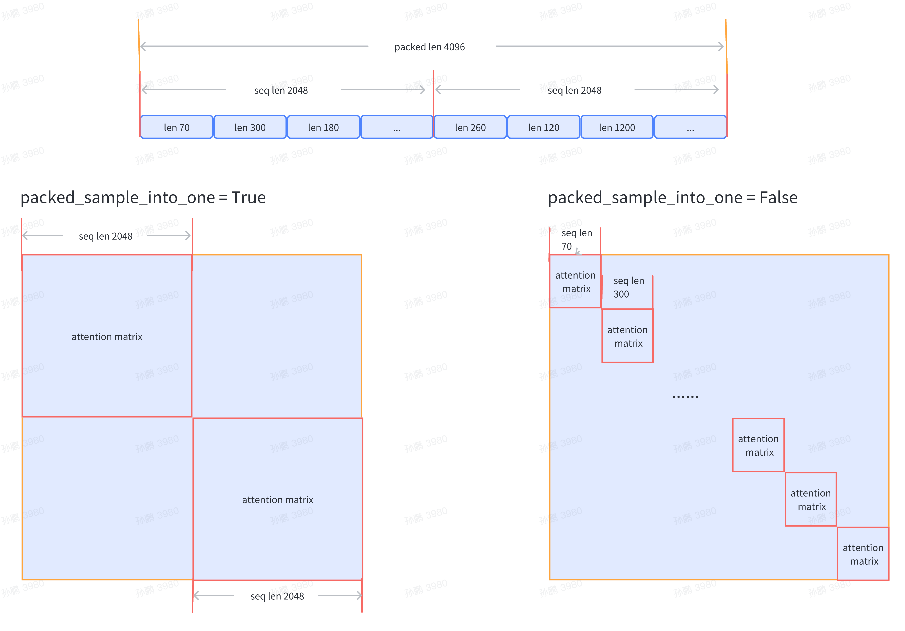

## 使用教程

启动一个 Demo 模型训练，需要进行三项准备，**安装**，**数据集准备**和**模型训练配置**。接下来，首先会介绍数据准备相关的操作，再简要描述模型训练配置相关的内容。

### 安装
请参考[安装文档](./install.md)进行安装。

### 数据准备 （预训练）

InternLM训练任务的数据集包括一系列的`bin`和`meta`文件。使用`tokenizer`从原始文本文件生成训练用数据集。通过在`tools/tokenizer.py`中指定模型参数路径的方式来导入tokenizer模型。目前提供`V7_sft.model`来生成tokens。若想使用不同的模型，可直接修改`tokernizer.py`中的模型参数路径。

可以运行以下命令生成原始数据对应的`bin`和`meta`文件，其中参数`text_input_path`表示原始文本数据路径，目前支持`txt`、`json`和`jsonl`三种输入格式，`bin_output_path`表示生成的`bin`文件的保存路径。
```bash
$ python tools/tokenizer.py --text_input_path your_input_text_path --bin_output_path your_output_bin_path
```

下面是一个数据处理的例子：

给定一个包含原始数据集的文件`raw_data.txt`，原始数据集如下所示：
```bash
感恩生活中的每一个细节，才能真正体会到幸福的滋味。
梦想是人生的动力源泉，努力追逐，才能实现自己的目标。
学会宽容和理解，才能建立真正和谐的人际关系。
```

可以通过运行以下命令来生成`bin`和`meta`文件：
```bash
$ python tools/tokenizer.py --text_input_path raw_data.txt --bin_output_path cn/output.bin
```

需要注意的是，生成的`bin`文件需要保存在`cn`或者`en`或者`code`或者`ja`或者`ar`或者`kaoshi`这六个目录下，以区分数据集的类型。

其中，`cn`表示中文数据集；`en`表示英文数据集；`code`表示代码数据集；`ja`表示日语数据集；`ar`表示阿拉伯语数据集；`kaoshi`表示考试数据集。

生成的bin文件的格式如下：
```python
{"tokens": [73075, 75302, 69522, 69022, 98899, 67713, 68015, 81269, 74637, 75445, 99157]}
{"tokens": [69469, 60355, 73026, 68524, 60846, 61844, 98899, 67775, 79241, 98899, 67713, 67800, 67453, 67838, 99157]}
{"tokens": [68057, 79017, 60378, 68014, 98899, 67713, 67990, 68015, 70381, 67428, 61003, 67622, 99157]}
```
`bin`文件中的每一行均对应原始数据集中的每一个句子，表示每个句子的`token`（下文将用sequence指定）。

生成的`meta`文件的格式如下：
```bash
(0, 11), (90, 15), (208, 13)
```
在`meta`文件中，每个元组对应着`bin`文件中每一个`sequence`的元信息。其中，元组的第一个元素表示每个`sequence`在所有`sequence`中的`starting index`，第二个元素表示每个`sequence`中有多少个`tokens`。

例如，对于第一个`sequence`，`starting index`为 0，有 11 个`tokens`；对于第二个`sequence`，由于第一个`sequence`转换为`string`后的长度为`89`，因此它的`starting index`为 90，有 15 个`tokens`。

`json`和`jsonl`类型的文件的`bin`和`meta`文件格式和`txt`一致，此处不再赘叙。

### 数据准备 （微调）

微调任务的数据集格式与预训练任务保持一致，生成的数据格式为一系列的`bin`和`meta`文件。以下以 Alpaca 数据集为例，介绍微调的数据准备流程。

1. 下载 [Alpaca 数据集](https://github.com/tatsu-lab/stanford_alpaca/blob/main/alpaca_data.json)

2. 对 Alpaca 数据进行 tokenize，使用以下命令

```shell
python tools/alpaca_tokenizer.py /path/to/alpaca_dataset /path/to/output_dataset /path/to/tokenizer --split_ratio 0.1
```

建议用户参考 alpaca_tokenizer.py 编写新的脚本对自己的数据集进行 tokenize

### 训练配置

以 7B Demo 的配置文件`configs/7B_sft.py`为例：
```python
JOB_NAME = "7b_train"
DO_ALERT = False

SEQ_LEN = 2048
HIDDEN_SIZE = 4096
NUM_ATTENTION_HEAD = 32
MLP_RATIO = 8 / 3
NUM_LAYER = 32
VOCAB_SIZE = 103168

MODEL_ONLY_FOLDER = "local:llm_ckpts/xxxx"
# Ckpt folder format:
# fs: 'local:/mnt/nfs/XXX'
SAVE_CKPT_FOLDER = "local:llm_ckpts"
LOAD_CKPT_FOLDER = "local:llm_ckpts/49"

# boto3 Ckpt folder format:
# import os
# BOTO3_IP = os.environ["BOTO3_IP"] # boto3 bucket endpoint
# SAVE_CKPT_FOLDER = f"boto3:s3://model_weights.{BOTO3_IP}/internlm"
# LOAD_CKPT_FOLDER = f"boto3:s3://model_weights.{BOTO3_IP}/internlm/snapshot/1/"
CHECKPOINT_EVERY = 50
ckpt = dict(
    enable_save_ckpt=False,  # enable ckpt save.
    save_ckpt_folder=SAVE_CKPT_FOLDER,  # Path to save training ckpt.
    # load_ckpt_folder= dict(path=MODEL_ONLY_FOLDER, content=["model"], ckpt_type="normal"),
    load_ckpt_folder="local:llm_ckpts/",
    # 'load_ckpt_info' setting guide:
    # 1. the 'path' indicate ckpt path,
    # 2. the 'content‘ means what states will be loaded, support: "model", "sampler", "optimizer", "scheduler", "all"
    # 3. the ’ckpt_type‘ means the type of checkpoint to be loaded, now only 'normal' type is supported.
    load_ckpt_info=dict(path=MODEL_ONLY_FOLDER, content=("model",), ckpt_type="internlm"),
    checkpoint_every=CHECKPOINT_EVERY,
    async_upload=True,  # async ckpt upload. (only work for boto3 ckpt)
    async_upload_tmp_folder="/dev/shm/internlm_tmp_ckpt/",  # path for temporarily files during asynchronous upload.
    oss_snapshot_freq=int(CHECKPOINT_EVERY / 2),  # snapshot ckpt save frequency.
)

TRAIN_FOLDER = "/path/to/dataset"
VALID_FOLDER = "/path/to/dataset"
data = dict(
    seq_len=SEQ_LEN,
    # micro_num means the number of micro_batch contained in one gradient update
    micro_num=4,
    # packed_length = micro_bsz * SEQ_LEN
    micro_bsz=2,
    # defaults to the value of micro_num
    valid_micro_num=4,
    # defaults to 0, means disable evaluate
    valid_every=50,
    pack_sample_into_one=False,
    total_steps=50000,
    skip_batches="",
    rampup_batch_size="",
    # Datasets with less than 50 rows will be discarded
    min_length=50,
    # train_folder=TRAIN_FOLDER,
    # valid_folder=VALID_FOLDER,
    empty_cache_and_diag_interval=10,
    diag_outlier_ratio=1.1,
)

grad_scaler = dict(
    fp16=dict(
        # the initial loss scale, defaults to 2**16
        initial_scale=2**16,
        # the minimum loss scale, defaults to None
        min_scale=1,
        # the number of steps to increase loss scale when no overflow occurs
        growth_interval=1000,
    ),
    # the multiplication factor for increasing loss scale, defaults to 2
    growth_factor=2,
    # the multiplication factor for decreasing loss scale, defaults to 0.5
    backoff_factor=0.5,
    # the maximum loss scale, defaults to None
    max_scale=2**24,
    # the number of overflows before decreasing loss scale, defaults to 2
    hysteresis=2,
)

hybrid_zero_optimizer = dict(
    # Enable low_level_optimzer overlap_communication
    overlap_sync_grad=True,
    overlap_sync_param=True,
    # bucket size for nccl communication params
    reduce_bucket_size=512 * 1024 * 1024,
    # grad clipping
    clip_grad_norm=1.0,
)

loss = dict(
    label_smoothing=0,
)

adam = dict(
    lr=1e-4,
    adam_beta1=0.9,
    adam_beta2=0.95,
    adam_beta2_c=0,
    adam_eps=1e-8,
    weight_decay=0.01,
)

lr_scheduler = dict(
    total_steps=data["total_steps"],
    init_steps=0,  # optimizer_warmup_step
    warmup_ratio=0.01,
    eta_min=1e-5,
    last_epoch=-1,
)

beta2_scheduler = dict(
    init_beta2=adam["adam_beta2"],
    c=adam["adam_beta2_c"],
    cur_iter=-1,
)

model = dict(
    checkpoint=False,  # The proportion of layers for activation aheckpointing, the optional value are True/False/[0-1]
    num_attention_heads=NUM_ATTENTION_HEAD,
    embed_split_hidden=True,
    vocab_size=VOCAB_SIZE,
    embed_grad_scale=1,
    parallel_output=True,
    hidden_size=HIDDEN_SIZE,
    num_layers=NUM_LAYER,
    mlp_ratio=MLP_RATIO,
    apply_post_layer_norm=False,
    dtype="torch.float16",  # Support: "torch.float16", "torch.half", "torch.bfloat16", "torch.float32", "torch.tf32"
    norm_type="rmsnorm",
    layer_norm_epsilon=1e-5,
    use_flash_attn=True,
    num_chunks=1,  # if num_chunks > 1, interleaved pipeline scheduler is used.
)
"""
zero1 parallel:
    1. if zero1 <= 0, The size of the zero process group is equal to the size of the dp process group,
        so parameters will be divided within the range of dp.
    2. if zero1 == 1, zero is not used, and all dp groups retain the full amount of model parameters.
    3. zero1 > 1 and zero1 <= dp world size, the world size of zero is a subset of dp world size.
        For smaller models, it is usually a better choice to split the parameters within nodes with a setting <= 8.
pipeline parallel (dict):
    1. size: int, the size of pipeline parallel.
    2. interleaved_overlap: bool, enable/disable communication overlap when using interleaved pipeline scheduler.
tensor parallel: tensor parallel size, usually the number of GPUs per node.
"""
parallel = dict(
    zero1=8,
    pipeline=dict(size=1, interleaved_overlap=True),
    sequence_parallel=False,
)

cudnn_deterministic = False
cudnn_benchmark = False

monitor = dict(
    # feishu alert configs
    alert=dict(
        enable_feishu_alert=DO_ALERT,
        feishu_alert_address=None,  # feishu webhook to send alert message
        light_monitor_address=None,  # light_monitor address to send heartbeat
    ),
)
```
接下来将详细介绍启动一个模型训练所需要进行的数据、模型、并行和监控等相关的配置。

#### 数据配置
数据相关的关键参数配置及释义如下所示：
```python
TRAIN_FOLDER = "/path/to/dataset"
SEQ_LEN = 2048
data = dict(
    seq_len=SEQ_LEN,  # 数据样本长度，默认值为 2048
    micro_num=1,  # micro_num 是指在一次模型参数更新中会处理的 micro_batch 的数目，默认值为 1
    micro_bsz=1,  # packed_length = micro_bsz * SEQ_LEN，为一次处理的 micro_batch 的数据大小，默认值为 1
    total_steps=50000,  # 总的所需执行的 step 的数目，默认值为 50000
    min_length=50,  # 若数据集文件中，数据行数少于50，将会被废弃
    train_folder=TRAIN_FOLDER,  # 数据集文件路径，默认值为 None；若 train_folder 为空，则以自动生成的随机数据集进行训练测试
    pack_sample_into_one=False, # 数据整理的逻辑，决定是按照 seq_len 维度或者是 sequence 的真实长度来进行attention计算
)
```




目前支持传入数据集文件路径`train_folder`，且要求文件格式如下：
```bash
- folder
    - code
        train_000.bin
        train_000.bin.meta
```
数据集的详细内容可参考``数据准备``模块相关的介绍。

#### 模型配置

如果在启动训练时要加载模型 `checkpoint`，可进行如下相关配置：
```python
SAVE_CKPT_FOLDER = "local:/path/to/save/ckpt"
LOAD_CKPT_FOLDER = "local:/path/to/load/resume/ckpt"
ckpt = dict(
    save_ckpt_folder=SAVE_CKPT_FOLDER,  # 存储模型和优化器 checkpoint 的路径
    checkpoint_every=float("inf"),  # 每多少个 step 存储一次 checkpoint，默认值为 inf
    # 断点续训时，加载模型和优化器等权重的路径，将从指定的 step 恢复训练
    # content 表示哪些状态会被加载，支持： "model", "sampler", "optimizer", "scheduler", "all"
    # ckpt_type 表示加载的模型类型，目前支持: "internlm"
    load_ckpt_info=dict(path=MODEL_ONLY_FOLDER, content=("model",), ckpt_type="internlm"),
)
```
注意：
- 路径若以 `local:` 为前缀，则存储在本地文件系统；若以 `boto3:` 为前缀，则存储在远程 oss 上

模型相关关键参数配置如下所示：
```python
model_type = "INTERNLM"  # 模型类型，默认值为 "INTERNLM"，对应模型结构初始化接口函数
NUM_ATTENTION_HEAD = 32
VOCAB_SIZE = 103168
HIDDEN_SIZE = 4096
NUM_LAYER = 32
MLP_RATIO = 8 / 3
model = dict(
    checkpoint=False,   # 进行重计算的模型层数比例，可选值为 True/False/[0-1]
    num_attention_heads=NUM_ATTENTION_HEAD,
    embed_split_hidden=True,
    vocab_size=VOCAB_SIZE,
    embed_grad_scale=1,
    parallel_output=True,
    hidden_size=HIDDEN_SIZE,
    num_layers=NUM_LAYER,
    mlp_ratio=MLP_RATIO,
    apply_post_layer_norm=False,
    dtype="torch.bfloat16",
    norm_type="rmsnorm",
    layer_norm_epsilon=1e-5,
)
```
注意：用户可自定义模型类型名和模型结构，并配置相对应的模型参数。通过`utils/registry.py`下的`MODEL_INITIALIZER`对象进行模型初始化函数接口注册，在训练主函数`train.py`中初始化模型时，可通过`model_type`配置获取指定的模型初始化接口函数。

*如果基于 InternLM 7B继续训练，可以参考 [ModelZoo](https://github.com/InternLM/InternLM/tree/main#model-zoo) 中 OpenXLab 链接下载权重*

#### 并行配置

训练并行配置样例如下：
```python
parallel = dict(
    zero1=8,
    tensor=1,
    pipeline=dict(size=1, interleaved_overlap=True),
    sequence_parallel=False,
)
```
- zero1：zero 并行策略，分如下三种情况，默认值为 -1
  - 当`zero1 <= 0`，则 zero1 进程组的大小等于数据并行进程组的大小，因此优化器状态参数将在数据并行范围内分配
  - 当`zero1 == 1`，则不使用 zero1 ，所有数据并行组保留完整的优化器状态参数
  - 当`zero1 > 1`且`zero1 <= data_parallel_world_size`，则 zero1 进程组是数据并行进程组的子集
- tensor：张量并行大小，通常是每个节点的 GPU 数量，默认值为 1
- pipeline：流水线并行策略
  - size：流水线并行大小，默认值为 1
  - interleaved_overlap：bool 类型，交错式调度时，开启或关闭通信优化，默认值为关闭
- sequence_parallel：是否开启序列化并行，默认值为 False

注意：`数据并行大小 = 总的 GPU 数目 / 流水线并行大小 / 张量并行大小`

### 启动训练

完成了以上数据集准备和相关训练配置后，可启动 Demo 训练。接下来分别以 slurm 和 torch 环境为例，介绍训练启动方式。

若在 slurm 上启动分布式运行环境，多节点 16 卡的运行命令如下所示：
```bash
$ srun -p internllm -N 2 -n 16 --ntasks-per-node=8 --gpus-per-task=1 python train.py --config ./configs/7B_sft.py
```

若在 torch 上启动分布式运行环境，单节点 8 卡的运行命令如下所示：
```bash
$ torchrun --nnodes=1 --nproc_per_node=8 train.py --config ./configs/7B_sft.py --launcher "torch"
```

### 运行结果

以 slurm 上单机 8 卡的 Demo 训练配置为例，训练结果日志展示如下：
```bash
2023-07-07 12:26:58,293	INFO launch.py:228 in launch -- Distributed environment is initialized, data parallel size: 8, pipeline parallel size: 1, tensor parallel size: 1
2023-07-07 12:26:58,293	INFO parallel_context.py:535 in set_seed -- initialized seed on rank 2, numpy: 1024, python random: 1024, ParallelMode.DATA: 1024, ParallelMode.TENSOR: 1024,the default parallel seed is ParallelMode.DATA.
2023-07-07 12:26:58,295	INFO train.py:378 in main -- ===========New Run Jul07_12-26-58 on host:SH-IDC1-10-140-0-135,tp:0,pp=0,dp=0===========
2023-07-07 12:26:58,296	INFO train.py:378 in main -- ===========New Run Jul07_12-26-58 on host:SH-IDC1-10-140-0-135,tp:0,pp=0,dp=5===========
2023-07-07 12:26:58,296	INFO train.py:378 in main -- ===========New Run Jul07_12-26-58 on host:SH-IDC1-10-140-0-135,tp:0,pp=0,dp=1===========
2023-07-07 12:26:58,296	INFO train.py:378 in main -- ===========New Run Jul07_12-26-58 on host:SH-IDC1-10-140-0-135,tp:0,pp=0,dp=6===========
2023-07-07 12:26:58,296	INFO train.py:378 in main -- ===========New Run Jul07_12-26-58 on host:SH-IDC1-10-140-0-135,tp:0,pp=0,dp=7===========
2023-07-07 12:26:58,296	INFO train.py:378 in main -- ===========New Run Jul07_12-26-58 on host:SH-IDC1-10-140-0-135,tp:0,pp=0,dp=2===========
2023-07-07 12:26:58,296	INFO train.py:378 in main -- ===========New Run Jul07_12-26-58 on host:SH-IDC1-10-140-0-135,tp:0,pp=0,dp=4===========
2023-07-07 12:26:58,296	INFO train.py:378 in main -- ===========New Run Jul07_12-26-58 on host:SH-IDC1-10-140-0-135,tp:0,pp=0,dp=3===========
2023-07-07 12:28:27,826	INFO hybrid_zero_optim.py:295 in _partition_param_list -- Number of elements on ranks: [907415552, 907411456, 910163968, 910163968, 921698304, 921698304, 921698304, 921698304], rank:0
2023-07-07 12:28:57,802	INFO train.py:323 in record_current_batch_training_metrics -- tflops=63.27010355651958,step=0,loss=11.634403228759766,tgs (tokens/gpu/second)=1424.64,lr=4.0000000000000003e-07,loss_scale=65536.0,grad_norm=63.672620777841004,micro_num=4,num_consumed_tokens=131072,inf_nan_skip_batches=0,num_samples_in_batch=19,largest_length=2048,largest_batch=5,smallest_batch=4,adam_beta2=0.95,fwd_bwd_time=6.48
2023-07-07 12:29:01,636	INFO train.py:323 in record_current_batch_training_metrics -- tflops=189.83371103277346,step=1,loss=11.613704681396484,tgs (tokens/gpu/second)=4274.45,lr=6.000000000000001e-07,loss_scale=65536.0,grad_norm=65.150786641452,micro_num=4,num_consumed_tokens=262144,inf_nan_skip_batches=0,num_samples_in_batch=16,largest_length=2048,largest_batch=5,smallest_batch=3,adam_beta2=0.95,fwd_bwd_time=3.67
2023-07-07 12:29:05,451	INFO train.py:323 in record_current_batch_training_metrics -- tflops=190.99928472960033,step=2,loss=11.490386962890625,tgs (tokens/gpu/second)=4300.69,lr=8.000000000000001e-07,loss_scale=65536.0,grad_norm=61.57798028719357,micro_num=4,num_consumed_tokens=393216,inf_nan_skip_batches=0,num_samples_in_batch=14,largest_length=2048,largest_batch=4,smallest_batch=3,adam_beta2=0.95,fwd_bwd_time=3.66
2023-07-07 12:29:09,307	INFO train.py:323 in record_current_batch_training_metrics -- tflops=188.8613541410694,step=3,loss=11.099515914916992,tgs (tokens/gpu/second)=4252.55,lr=1.0000000000000002e-06,loss_scale=65536.0,grad_norm=63.5478796484391,micro_num=4,num_consumed_tokens=524288,inf_nan_skip_batches=0,num_samples_in_batch=16,largest_length=2048,largest_batch=5,smallest_batch=3,adam_beta2=0.95,fwd_bwd_time=3.7
2023-07-07 12:29:13,147	INFO train.py:323 in record_current_batch_training_metrics -- tflops=189.65918563194305,step=4,loss=10.149517059326172,tgs (tokens/gpu/second)=4270.52,lr=1.2000000000000002e-06,loss_scale=65536.0,grad_norm=51.582841631508145,micro_num=4,num_consumed_tokens=655360,inf_nan_skip_batches=0,num_samples_in_batch=19,largest_length=2048,largest_batch=6,smallest_batch=3,adam_beta2=0.95,fwd_bwd_time=3.68
2023-07-07 12:29:16,994	INFO train.py:323 in record_current_batch_training_metrics -- tflops=189.3109313713174,step=5,loss=9.822169303894043,tgs (tokens/gpu/second)=4262.67,lr=1.4000000000000001e-06,loss_scale=65536.0,grad_norm=47.10386835560855,micro_num=4,num_consumed_tokens=786432,inf_nan_skip_batches=0,num_samples_in_batch=17,largest_length=2048,largest_batch=6,smallest_batch=3,adam_beta2=0.95,fwd_bwd_time=3.69
```
