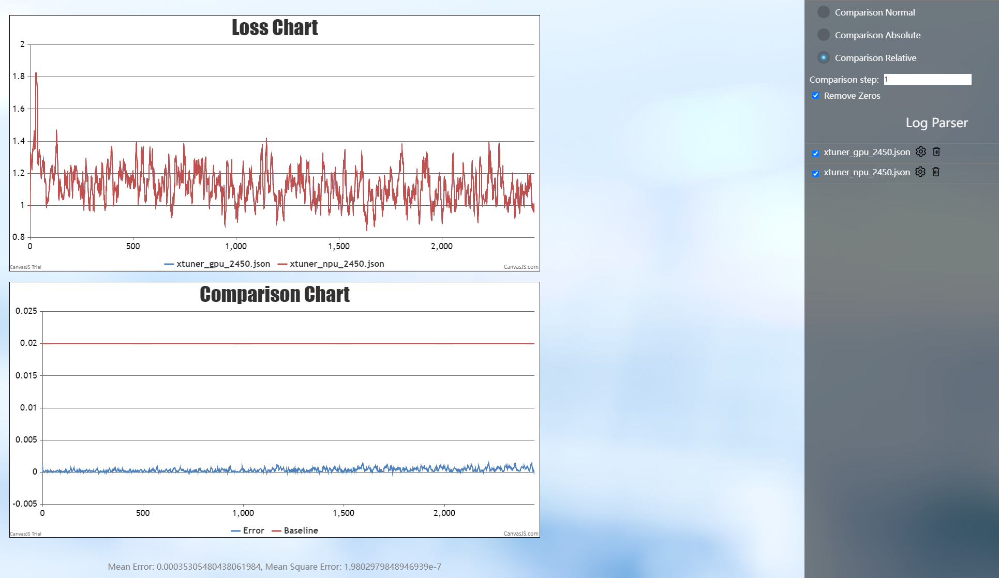
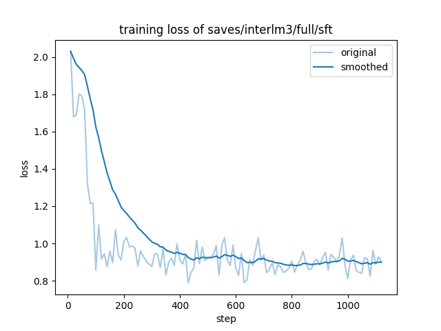
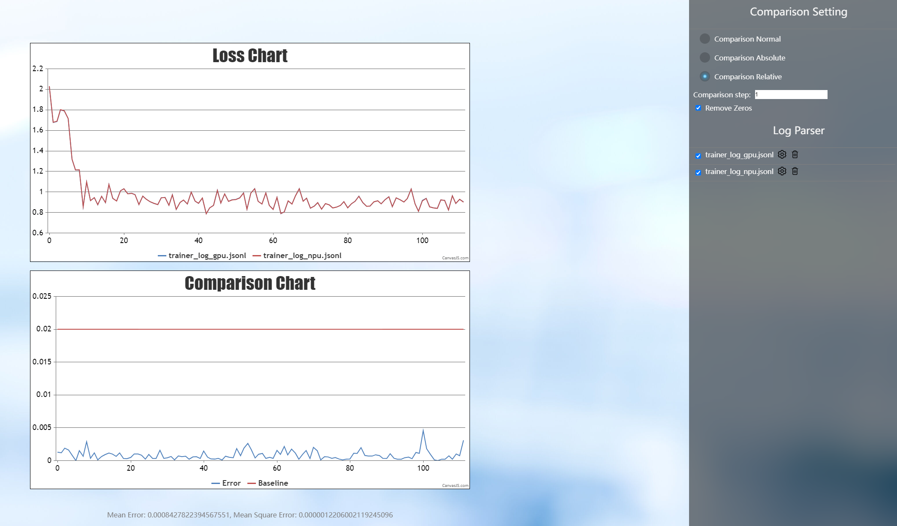
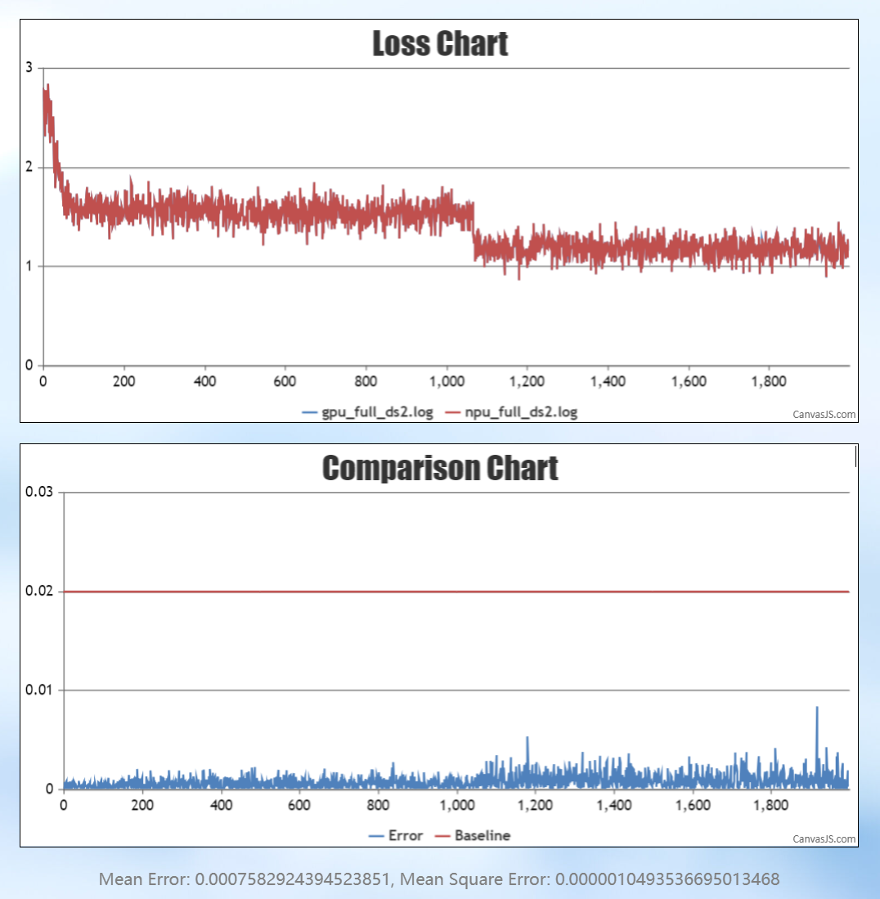
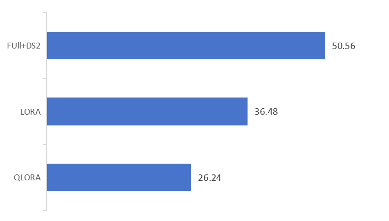
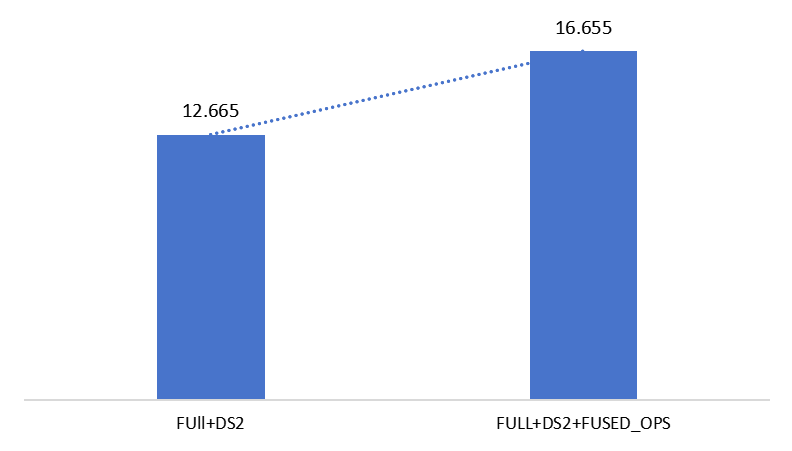

# InternLM-NPU

<div align="center">


  <div> </div>
  <div align="center">
    <b><font size="5">InternLM</font></b>
    <sup>
      <a href="https://internlm.intern-ai.org.cn/">
        <i><font size="4">HOT</font></i>
      </a>
    </sup>
    <div> </div>
  </div>

[](../LICENSE)
[](https://github.com/internLM/OpenCompass/)

<!-- [](https://internlm.readthedocs.io/zh_CN/latest/?badge=latest) -->

[📘Commercial Application](#license) |
[🤗HuggingFace](https://huggingface.co/internlm) |
[🆕Update News](#news) |
[🤔Reporting Issues](https://github.com/InternLM/InternLM/issues/new) |
[📜Technical Report](https://arxiv.org/abs/2403.17297)<br>
[💬Chat Web](https://internlm-chat.intern-ai.org.cn/) |
[🔗API](https://internlm.intern-ai.org.cn/api/document) |
[🧩Modelers](https://modelers.cn/spaces/MindSpore-Lab/INTERNLM2-20B-PLAN)

[English](README_npu.md) |
[简体中文](README_npu_zh-CN.md)

</div>

## Introduction
This is a guide to using Ascend NPU to train and infer the InternLM series models.

## News
\[2025.01.15\] InternLM3-8B-Instruct can be used in Xtuner, LLaMA-Factory, transformers and openMind.

## Model Zoo

### InternLM3

| Model                     | Transformers                                         | ModelScope                                                                                                                                                              | Modelers                                          | Release Date |
| ------------------------- | ---------------------------------------------------- |-------------------------------------------------------------------------------------------------------------------------------------------------------------------------| ------------------------------------------------- | ------------ |
| **InternLM3-8B-Instruct** | [🤗internlm3_8B_instruct](https://huggingface.co/internlm/internlm3-8b-instruct) | [ internlm3_8b_instruct](https://www.modelscope.cn/models/Shanghai_AI_Laboratory/internlm3-8b-instruct/summary) | [](https://modelers.cn/models/Intern/internlm3-8b-instruct) | 2025-01-15   |

## Environment Setup

### Installing Ascend CANN Toolkit and Kernels

For details about the installation method, see [Installation Scheme](https://gitee.com/link?target=https%3A%2F%2Fwww.hiascend.com%2Fdocument%2Fdetail%2Fzh%2FCANNCommunityEdition%2F80RC2alpha002%2Fquickstart%2Fquickstart%2Fquickstart_18_0004.html) or run the following commands:

```shell
# Replace the URL with the URL corresponding to the CANN version and device model.
# Install CANN Toolkit.
wget https://ascend-repo.obs.cn-east-2.myhuaweicloud.com/Milan-ASL/Milan-ASL%20V100R001C17SPC701/Ascend-cann-toolkit_8.0.RC1.alpha001_linux-"$(uname -i)".run
bash Ascend-cann-toolkit_8.0.RC1.alpha001_linux-"$(uname -i)".run --install

# Install CANN Kernels.
wget https://ascend-repo.obs.cn-east-2.myhuaweicloud.com/Milan-ASL/Milan-ASL%20V100R001C17SPC701/Ascend-cann-kernels-910b_8.0.RC1.alpha001_linux.run
bash Ascend-cann-kernels-910b_8.0.RC1.alpha001_linux.run --install

# Set environment variables.
source /usr/local/Ascend/ascend-toolkit/set_env.sh
```

## Xtuner

### Installing Xtuner

```shell
git clone https://github.com/InternLM/xtuner.git
cd xtuner
```

Modify `requirements/runtime.txt` with the following changes:

```text
bitsandbytes==0.42.0
torchvision==0.19.0
numpy==1.26.4
```

Use the following command for installation:

```shell
pip install -e '.[all]'
```

**Note**:

- The default installation version of `torch` is the latest version. Please pay attention to match it with the version of `torch_npu`.

### LoRA Fine-tuning

Use the following commands to copy and rename the file to `internlm3_8b_instruct_lora_oasst1_e10.py`:

```shell
xtuner copy-cfg internlm2_5_chat_7b_qlora_oasst1_e3 .
mv internlm2_5_chat_7b_qlora_oasst1_e3_copy.py internlm3_8b_instruct_lora_oasst1_e10.py
```

The modifications to the configuration file `internlm3_8b_instruct_lora_oasst1_e10.py` are as follows:

```python
pretrained_model_name_or_path = 'internlm/internlm3-8b-instruct'

max_epochs = 10

model = dict(
    type=SupervisedFinetune,
    use_varlen_attn=use_varlen_attn,
    llm=dict(
        type=AutoModelForCausalLM.from_pretrained,
        pretrained_model_name_or_path=pretrained_model_name_or_path,
        trust_remote_code=True,
        torch_dtype=torch.float16),
        # quantization_config=dict(
        #     type=BitsAndBytesConfig,
        #     load_in_4bit=True,
        #     load_in_8bit=False,
        #     llm_int8_threshold=6.0,
        #     llm_int8_has_fp16_weight=False,
        #     bnb_4bit_compute_dtype=torch.float16,
        #     bnb_4bit_use_double_quant=True,
        #     bnb_4bit_quant_type='nf4')),

randomness = dict(seed=123, deterministic=True)
```

Run the following commands to start single-machine eight-card fine-tuning:

```shell
NPROC_PER_NODE=8 xtuner train internlm3_8b_instruct_lora_oasst1_e10.py --deepspeed deepspeed_zero2
```

The fine-tuning results are saved in the directory `./work_dirs/internlm3_8b_instruct_lora_oasst1_e10/iter_xxx.pth`.
The comparison of loss between NPU and GPU is as follows:



### Model Convert

Convert the model weight file obtained from fine-tuning into the Hugging Face format, which facilitates subsequent deployment and usage.
Use the following command for the conversion:

```shell
xtuner convert pth_to_hf internlm3_8b_instruct_lora_oasst1_e10.py ./work_dirs/internlm3_8b_instruct_lora_oasst1_e10/iter_xxx.pth ./work_dirs/convert_output
```

### Model Merge

LoRA or QLoRA fine-tuning generates an additional `Adapter` layer, which needs to be merged with the original model to 
create a complete model. Use the following command for model merging, where `$model_path` is the local path where the 
original model is stored, and `--max-shard-size` 2GB limits the maximum size of each weight file to 2GB:

```shell
xtuner convert merge $model_path ./work_dirs/convert_output ./work_dirs/merge_output --max-shard-size 2GB
```

### Chat

Chat with the merged model weights:


```shell
cp path_to_your_model/modeling_internlm3.py ./work_dirs/merge_output
xtuner chat ./work_dirs/merge_output --prompt-template internlm2_chat
```

## LLaMA-Factory

### Installing LLaMA-Factory

```shell
git clone --depth 1 https://github.com/hiyouga/LLaMA-Factory.git
cd LLaMA-Factory
pip install -e ".[torch-npu,metrics]"
```

### Inference

Create the `examples/inference/internlm3_8b_instruct.yaml` inference configuration file in the LLaMA-Factory directory:

```yaml
model_name_or_path: xxx # Support only local loading. Set this parameter to the local weight path of InternLM3-8B-Instruct.
trust_remote_code: true
template: intern3
```

Run the following command to interact with the model:

```shell
llamafactory-cli chat examples/inference/internlm3_8b_instruct.yaml
```

### Fine-tuning

Create the `examples/train_full/internlm3_8b_instruct_full_sft.yaml` configuration file in the LLaMA-Factory directory. The fine-tuning configuration file is as follows:

```yaml
### model
model_name_or_path: xxx # Support only local loading. Set this parameter to the local weight path of InternLM3-8B-Instruct.
trust_remote_code: true

### method
stage: sft
do_train: true
finetuning_type: full
deepspeed: examples/deepspeed/ds_z3_config.json  # choices: [ds_z0_config.json, ds_z2_config.json, ds_z3_config.json]

### dataset
dataset: alpaca_data
template: intern3
cutoff_len: 4096
max_samples: 10000
overwrite_cache: true
preprocessing_num_workers: 16

### output
output_dir: saves/interlm3/full/sft
logging_steps: 10
save_steps: 500
plot_loss: true
overwrite_output_dir: true

### train
per_device_train_batch_size: 1
gradient_accumulation_steps: 1
learning_rate: 1.0e-6
num_train_epochs: 1.0
lr_scheduler_type: cosine
warmup_ratio: 0.1
bf16: true
ddp_timeout: 180000000

### eval
val_size: 0.1
per_device_eval_batch_size: 1
eval_strategy: steps
eval_steps: 5000000000
```

Run the following commands to start fine-tuning:

```shell
llamafactory-cli train examples/train_full/internlm3_8b_instruct_full_sft.yaml
```

### Accuracy

The loss curve obtained after finetuning is as follows:



The loss curve compared with GPU is as follows:



## Transformers

### Inference

Create the inference script `inference_internlm3_instruct_8b.py`:

```python
import torch
from transformers import AutoTokenizer, AutoModelForCausalLM
model_dir = "internlm/internlm3-8b-instruct"
tokenizer = AutoTokenizer.from_pretrained(model_dir, trust_remote_code=True)
# Set `torch_dtype=torch.float16` to load model in float16, otherwise it will be loaded as float32 and might cause OOM Error.
model = AutoModelForCausalLM.from_pretrained(model_dir, trust_remote_code=True, torch_dtype=torch.float16).npu()
# (Optional) If on low resource devices, you can load model in 4-bit or 8-bit to further save GPU memory via bitsandbytes.
  # InternLM3 8B in 4bit will cost nearly 8GB GPU memory.
  # pip install -U bitsandbytes
  # 8-bit: model = AutoModelForCausalLM.from_pretrained(model_dir, trust_remote_code=True, load_in_8bit=True).npu()
  # 4-bit: model = AutoModelForCausalLM.from_pretrained(model_dir, trust_remote_code=True, load_in_4bit=True).npu()
model = model.eval()
system_prompt = """You are an AI assistant whose name is InternLM (书生·浦语).
- InternLM (书生·浦语) is a conversational language model that is developed by Shanghai AI Laboratory (上海人工智能实验室). It is designed to be helpful, honest, and harmless.
- InternLM (书生·浦语) can understand and communicate fluently in the language chosen by the user such as English and 中文."""
messages = [
    {"role": "system", "content": system_prompt},
    {"role": "user", "content": "Please tell me five scenic spots in Shanghai"},
 ]
tokenized_chat = tokenizer.apply_chat_template(messages, tokenize=True, add_generation_prompt=True, return_tensors="pt").npu()
generated_ids = model.generate(tokenized_chat, max_new_tokens=1024, temperature=1, repetition_penalty=1.005, top_k=40, top_p=0.8)
generated_ids = [
    output_ids[len(input_ids):] for input_ids, output_ids in zip(tokenized_chat, generated_ids)
]
prompt = tokenizer.batch_decode(tokenized_chat)[0]
print(prompt)
response = tokenizer.batch_decode(generated_ids)[0]
print(response)
```

Execute the inference script:

```shell
python inference_internlm3_instruct_8b.py
```

## openMind Library

### Introduction to openMind

The openMind Library is an open-source suite for large-scale models, natively supporting fine-tuning, inference, evaluation, and deployment on Ascend NPUs. The openMind Library offers highly user-friendly interfaces and usage methods, fully leveraging the performance of Ascend NPUs to rapidly support and enhance cutting-edge industry models.

### Fine-Tuning

The openMind Library provides a one-click model fine-tuning solution on Ascend NPUs, encompassing capabilities such as data processing, multi-site weight loading, low-rank adaptation (LoRA), and quantization adaptation (QLoRA). Additionally, the openMind Library supports optimization of Ascend NPU fused operators, enhancing model training performance.

#### Installing the openMind Library

```shell
git clone -b dev https://gitee.com/ascend/openmind.git
cd openmind
pip install -e .[pt]
```

#### Initiating Fine-Tuning

Within the openMind directory, fine-tuning can be initiated using the following command line:

```
openmind-cli train examples/internlm3/train_sft_full_internlm3.yaml
```

#### Training Results and Advantages

As illustrated in the figure below, the training loss of the openMind Library normally converges, and compared with the GPU, the average relative error is within 2%.

<div align=center>
  
</div>

<p align="center"><strong>Accuracy Comparison</strong> (npu=8, per_device_train_batch_size=6, max_length=1024)</p>

The openMind Library supports the enabling of fine-tuning methods such as LoRA and QLoRA on Ascend NPUs, significantly reducing device memory usage. As illustrated in the figure below, employing the QLoRA fine-tuning method can lead to approximately a 40% reduction in device memory consumption.

<div align=center>
  
</div>

<p align="center"><strong>Memory Consumption</strong> (npu=8, per_device_train_batch_size=6, max_length=1024)</p>

The openMind Library facilitates the automatic loading of Ascend NPU fused operators during training, eliminating the need for developers to manually modify code or configurations. This enhances model training performance while maintaining ease of use. The figure below demonstrates the performance benefits achieved by default when the openMind Library enables Ascend NPU fused operators.

<div align=center>
  
</div>

<p align="center"><strong>Training Samples per Second</strong></p>

For more features, please refer to the [openMind Fine-tuning Documentation](https://modelers.cn/docs/en/openmind-library/1.0.0/basic_tutorial/finetune/finetune_pt.html).

### Inference

In addition to fine-tuning, the openMind Library can also be utilized for model inference. After installing the openMind Library, a single round of inference can be conducted using the following command line:

```shell
openmind-cli run Intern/internlm3-8b-instruct --task text-generation --input '{"text_inputs":"What is AI?","max_length":512}' --trust_remote_code 1
```

For more features, please refer to the [openMind Inference Documentation](https://modelers.cn/docs/en/openmind-library/1.0.0/basic_tutorial/pipeline.html).

## License
Code and model weights are licensed under Apache-2.0.