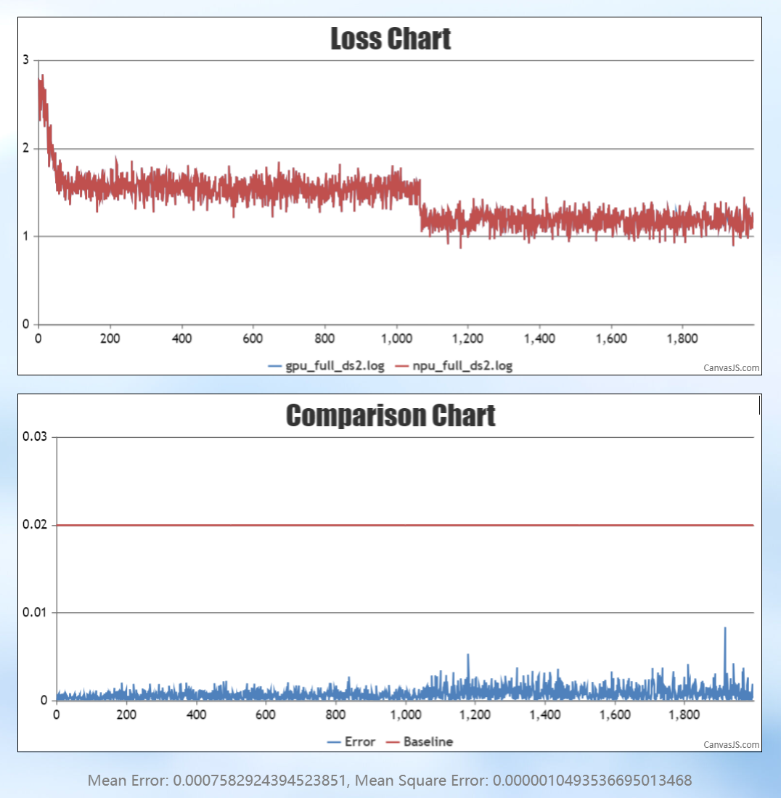
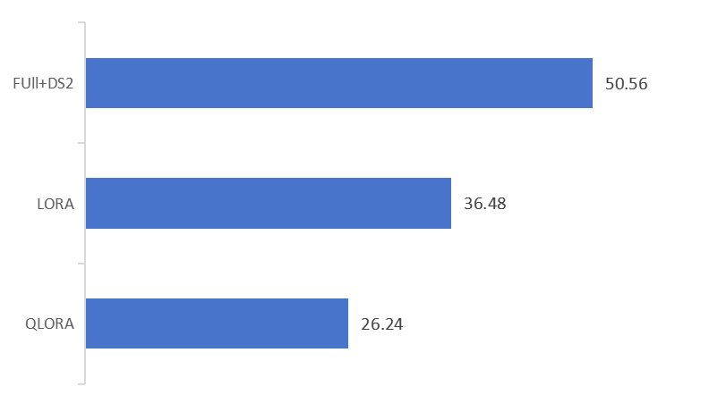

# InternLM-NPU

<div align="center">


  <div>&nbsp;</div>
  <div align="center">
    <b><font size="5">书生·浦语 官网</font></b>
    <sup>
      <a href="https://internlm.intern-ai.org.cn/">
        <i><font size="4">HOT</font></i>
      </a>
    </sup>
    <div>&nbsp;</div>
  </div>

[](https://github.com/open-mmlab/mmdetection/blob/main/LICENSE)
[](https://github.com/internLM/OpenCompass/)

<!-- [](https://internlm.readthedocs.io/zh_CN/latest/?badge=latest) -->

[📘商业授权](#开源许可证) |
[🤗HuggingFace](https://huggingface.co/internlm) |
[🆕最新消息](#更新) |
[🤔提交反馈](https://github.com/InternLM/InternLM/issues/new)|
[📜技术报告](https://arxiv.org/abs/2403.17297)<br>
[💬聊天应用](https://internlm-chat.intern-ai.org.cn/) |
[🔗API](https://internlm.intern-ai.org.cn/api/document) |
[🧩魔乐社区](https://modelers.cn/spaces/MindSpore-Lab/INTERNLM2-20B-PLAN)

[English](README_npu.md) |
[简体中文](README_npu_zh-CN.md)

</div>

## 介绍
这是一份使用 Ascend NPU 对 InternLM 系列模型进行训练和推理的指南。

## News
\[2025.01.15\] InternLM3-8B-Instruct 可用于 Xtuner、LLaMA-Factory、transformers 和 openMind 中。

## Model Zoo

### InternLM3

| Model                     | Transformers                                         | ModelScope                                                                                                                                                              | Modelers                                          | Release Date |
| ------------------------- | ---------------------------------------------------- |-------------------------------------------------------------------------------------------------------------------------------------------------------------------------| ------------------------------------------------- | ------------ |
| **InternLM3-8B-Instruct** | [🤗internlm3_8B_instruct](https://huggingface.co/internlm/internlm3-8b-instruct) | [ internlm3_8b_instruct](https://www.modelscope.cn/models/Shanghai_AI_Laboratory/internlm3-8b-instruct/summary) | [](https://modelers.cn/models/Intern/internlm3-8b-instruct) | 2025-01-15   |

## 环境准备

### 安装Ascend CANN Toolkit和Kernels

安装方法请参考[安装教程](https://gitee.com/link?target=https%3A%2F%2Fwww.hiascend.com%2Fdocument%2Fdetail%2Fzh%2FCANNCommunityEdition%2F80RC2alpha002%2Fquickstart%2Fquickstart%2Fquickstart_18_0004.html)或使用以下命令

```shell
# 请替换URL为CANN版本和设备型号对应的URL
# 安装CANN Toolkit
wget https://ascend-repo.obs.cn-east-2.myhuaweicloud.com/Milan-ASL/Milan-ASL%20V100R001C17SPC701/Ascend-cann-toolkit_8.0.RC1.alpha001_linux-"$(uname -i)".run
bash Ascend-cann-toolkit_8.0.RC1.alpha001_linux-"$(uname -i)".run --install

# 安装CANN Kernels
wget https://ascend-repo.obs.cn-east-2.myhuaweicloud.com/Milan-ASL/Milan-ASL%20V100R001C17SPC701/Ascend-cann-kernels-910b_8.0.RC1.alpha001_linux.run
bash Ascend-cann-kernels-910b_8.0.RC1.alpha001_linux.run --install

# 设置环境变量
source /usr/local/Ascend/ascend-toolkit/set_env.sh
```

## Xtuner

### 安装 Xtuner

```shell
git clone https://github.com/InternLM/xtuner.git
cd xtuner
```

修改`requirements/runtime.txt`，修改点如下：

```text
bitsandbytes==0.42.0
torchvision==0.19.0
numpy==1.26.4
```

使用以下命令进行安装：

```shell
pip install -e '.[all]'
```

**注意**:

- 默认安装`torch`为最新版，请注意与`torch_npu`版本相匹配

### LoRA 微调

使用以下命令复制并重命名文件为`internlm3_8b_instruct_lora_oasst1_e10.py`， 

```shell
xtuner copy-cfg internlm2_5_chat_7b_qlora_oasst1_e3 .
mv internlm2_5_chat_7b_qlora_oasst1_e3_copy.py internlm3_8b_instruct_lora_oasst1_e10.py
```

`internlm3_8b_instruct_lora_oasst1_e10.py`配置文件的修改点如下：

```python
pretrained_model_name_or_path = 'internlm/internlm3-8b-instruct'

max_epochs = 10

model = dict(
    type=SupervisedFinetune,
    use_varlen_attn=use_varlen_attn,
    llm=dict(
        type=AutoModelForCausalLM.from_pretrained,
        pretrained_model_name_or_path=pretrained_model_name_or_path,
        trust_remote_code=True,
        torch_dtype=torch.float16),
        # quantization_config=dict(
        #     type=BitsAndBytesConfig,
        #     load_in_4bit=True,
        #     load_in_8bit=False,
        #     llm_int8_threshold=6.0,
        #     llm_int8_has_fp16_weight=False,
        #     bnb_4bit_compute_dtype=torch.float16,
        #     bnb_4bit_use_double_quant=True,
        #     bnb_4bit_quant_type='nf4')),

randomness = dict(seed=123, deterministic=True)
```

通过下列命令启动单机8卡微调：

```shell
NPROC_PER_NODE=8 xtuner train internlm3_8b_instruct_lora_oasst1_e10.py --deepspeed deepspeed_zero2
```

微调后结果保存在`./work_dirs/internlm3_8b_instruct_lora_oasst1_e10/iter_xxx.pth`，NPU与GPU的loss对比如下：


### 模型转换

将训练得到的模型权重文件转换为 Hugging Face 格式的模型文件，便于后续的部署和使用。使用以下命令进行转换：

```shell
xtuner convert pth_to_hf internlm3_8b_instruct_lora_oasst1_e10.py ./work_dirs/internlm3_8b_instruct_lora_oasst1_e10/iter_xxx.pth ./work_dirs/convert_output
```

### 模型合并

LoRA或QLoRA微调生成的是一个额外的 `Adapter` 层，需要与原模型合并才能生成一个完整的模型。使用以下命令进行模型合并，其中`$model_path`
为原模型存储的本地路径, `--max-shard-size 2GB` 限制每个权重文件最大为2GB：

```shell
xtuner convert merge $model_path ./work_dirs/convert_output ./work_dirs/merge_output --max-shard-size 2GB
```

### 对话

使用合并后的模型权重进行对话：

```shell
cp path_to_your_model/modeling_internlm3.py ./work_dirs/merge_output
xtuner chat ./work_dirs/merge_output --prompt-template internlm2_chat
```

## LLaMA-Factory

### 安装 LLaMA-Factory

```shell
git clone --depth 1 https://github.com/hiyouga/LLaMA-Factory.git
cd LLaMA-Factory
pip install -e ".[torch-npu,metrics]"
```

### 推理

在 LLaMA-Factory 路径下新建`examples/inference/internlm3_8b_instruct.yaml`推理配置文件，文件内容为：

```yaml
model_name_or_path: xxx # Support only local loading. Set this parameter to the local weight path of InternLM3-8B-Instruct.
trust_remote_code: true
template: intern3
```

使用以下命令与模型进行交互：

```shell
llamafactory-cli chat examples/inference/internlm3_8b_instruct.yaml
```

### 微调

在 LLaMA-Factory 路径下新建`examples/train_full/internlm3_8b_instruct_full_sft.yaml`微调配置文件，微调配置文件如下：

```yaml
### model
model_name_or_path: xxx # Support only local loading. Set this parameter to the local weight path of InternLM3-8B-Instruct.
trust_remote_code: true

### method
stage: sft
do_train: true
finetuning_type: full
deepspeed: examples/deepspeed/ds_z3_config.json  # choices: [ds_z0_config.json, ds_z2_config.json, ds_z3_config.json]

### dataset
dataset: alpaca_data
template: intern3
cutoff_len: 4096
max_samples: 10000
overwrite_cache: true
preprocessing_num_workers: 16

### output
output_dir: saves/interlm3/full/sft
logging_steps: 10
save_steps: 500
plot_loss: true
overwrite_output_dir: true

### train
per_device_train_batch_size: 1
gradient_accumulation_steps: 1
learning_rate: 1.0e-6
num_train_epochs: 1.0
lr_scheduler_type: cosine
warmup_ratio: 0.1
bf16: true
ddp_timeout: 180000000

### eval
val_size: 0.1
per_device_eval_batch_size: 1
eval_strategy: steps
eval_steps: 5000000000
```

通过下面的命令启动微调：

```shell
llamafactory-cli train examples/train_full/internlm3_8b_instruct_full_sft.yaml
```

### 精度

微调后得到的loss曲线如下：


与GPU对比的loss曲线如下：


## Transformers

### 推理

新建推理脚本`inference_internlm3_instruct_8b.py`，推理脚本内容为：

```python
import torch
from transformers import AutoTokenizer, AutoModelForCausalLM

model_dir = "internlm/internlm3-8b-instruct"
tokenizer = AutoTokenizer.from_pretrained(model_dir, trust_remote_code=True)
# `torch_dtype=torch.float16`可以令模型以float16精度加载，否则transformers会将模型加载为float32，导致显存不足
model = AutoModelForCausalLM.from_pretrained(model_dir, trust_remote_code=True, torch_dtype=torch.float16).npu()
# （可选）如果在低资源设备上，可以通过bitsandbytes以4位或8位加载模型，从而进一步节省GPU内存。
  # InternLM3 8B以4位加载将几乎占用8GB的GPU内存.
  # pip install -U bitsandbytes
  # 8-bit: model = AutoModelForCausalLM.from_pretrained(model_dir, trust_remote_code=True, load_in_8bit=True).npu()
  # 4-bit: model = AutoModelForCausalLM.from_pretrained(model_dir, trust_remote_code=True, load_in_4bit=True).npu()
model = model.eval()
system_prompt = """You are an AI assistant whose name is InternLM (书生·浦语).
- InternLM (书生·浦语) is a conversational language model that is developed by Shanghai AI Laboratory (上海人工智能实验室). It is designed to be helpful, honest, and harmless.
- InternLM (书生·浦语) can understand and communicate fluently in the language chosen by the user such as English and 中文."""
messages = [
    {"role": "system", "content": system_prompt},
    {"role": "user", "content": "Please tell me five scenic spots in Shanghai"},
 ]
tokenized_chat = tokenizer.apply_chat_template(messages, tokenize=True, add_generation_prompt=True, return_tensors="pt").npu
generated_ids = model.generate(tokenized_chat, max_new_tokens=1024, temperature=1, repetition_penalty=1.005, top_k=40, top_p=0.8)
generated_ids = [
    output_ids[len(input_ids):] for input_ids, output_ids in zip(tokenized_chat, generated_ids)
]
prompt = tokenizer.batch_decode(tokenized_chat)[0]
print(prompt)
response = tokenizer.batch_decode(generated_ids)[0]
print(response)
```

执行推理脚本：

```shell
python inference_internlm3_instruct_8b.py
```

## openMind Library

### openMind 简介

openMind Library 是一个开源的大模型套件，原生支持在昇腾NPU上进行微调、推理、评估和部署。
openMind Library 提供高易用性的接口和使用方式，充分发挥昇腾NPU的性能，快速支持、增强业界前沿模型。

### 微调

openMind Library 提供了昇腾 NPU 上的一键式模型微调方案，涵盖了数据处理、多站点权重加载，低参微调（LoRA）、
量化适配（QLoRA）等能力。同时，openMind Library支持昇腾NPU融合算子优化，提升模型训练性能。

#### 安装 openMind Library

```shell
git clone -b dev https://gitee.com/ascend/openmind.git
cd openmind
pip install -e .[pt]
```

#### 启动微调

在 openmind 文件夹下，通过以下命令行即可启动微调：

```
openmind-cli train examples/internlm3/train_sft_full_internlm3.yaml
```

#### 训练结果与优势

如下图所示，openMind Library 的训练 loss 正常收敛，同时和 GPU 对比，平均相对误差在 2% 以内。

<div align=center>
  
</div>

<p align="center"><strong>精度对比</strong> (npu=8, per_device_train_batch_size=6, max_length=1024)</p>

openMind Library 支持在昇腾 NPU 上使能 LoRA、QLoRA 等微调方法，显著减少 device 内存使用。
如下图所示，通过使能 QloRA 微调方式可减少 device 内存约 40%。

<div align=center>
  
</div>

<p align="center"><strong>Full/LoRA/QLoRA 显存开销</strong> (npu=8, per_device_train_batch_size=6, max_length=1024)</p>

openMind Library 支持训练时自动加载昇腾 NPU 融合算子，无需开发者手动修改代码或配置，提升模型训练性能
的同时兼顾易用性。下图展示了 openMind 默认使能昇腾 NPU 融合算子之后的性能收益。

<div align=center>
  
</div>

<p align="center"><strong>每秒训练样本数</strong></p>

更多特性请参考[openMind 微调文档](https://modelers.cn/docs/zh/openmind-library/1.0.0/basic_tutorial/finetune/finetune_pt.html)。

### 推理

除了微调以外，也可以使用 openMind Library 进行模型推理，安装 openMind Library 后，使用
下述命令行即可进行单轮推理：

```shell
openmind-cli run Intern/internlm3-8b-instruct --task text-generation --input '{"text_inputs":"What is AI?","max_length":512}' --trust_remote_code 1
```

更多特性请参考[openMind 推理文档](https://modelers.cn/docs/zh/openmind-library/1.0.0/basic_tutorial/pipeline.html)。

## 开源许可证

本仓库的代码和权重依照 Apache-2.0 协议开源。